# EffectCraft optimization candidate

Current distribution: plugin dev.60 pins source dev.58 (`d9ded4f4c5efc9d9aabd0ddc0123cd1bcf2f738d`). This increment includes file creation-generation claims and the bounded atomic desktop version guard. Candidate evidence retains its original timestamp and baseline. Physical GUI competition, legacy sessions, task 9.3.2 and 70 V1 tasks remain open.

Plugin dev.39 consumes the immutable dev.37 skill source recorded in skills.lock.json. Earlier candidate reports below retain their own snapshot identities. This change updates the existing establish-v1-plugin specification, traceability, and source-candidate validator. The source tag and commit are verified before vendoring; complete platform/host qualification remains open.

The independent skills repository owns the isolated Python bootstrap, seven pinned native artifacts, durable managed tasks, artifact review and bounded revisions. The pinned 0.4.0 catalog contains 655 commands; new commands remain NOT_RUN until exercised.

See [candidate evidence](evidence/managed-optimization-20261008.json), [source validation](evidence/managed-source-candidate-20261008.json), and [alpha handoff](evidence/managed-alpha-handoff-20261008.json). macOS arm64 native scenes and one Codex natural-language creation/revision delivery were exercised. The evidence records differences between that installed host snapshot and later validation hardening.

Segmented recovery has bounded local candidate evidence below. Open implementation: process ownership across supervisor restart, external GUI editing conflicts, complete resource metering, and Web managed editing. Open environment gates: other native OS/architecture combinations, FreeBSD build, Web GPU failure, and other hosts. Full V1 and aggregate tasks 9.1–9.6 remain open.

Run `python3 scripts/verify_candidate.py --source /absolute/effectcraft-skills --report /tmp/candidate.json`. Source publication, immutable plugin vendoring and marketplace updates require separate release authorization and never replace native acceptance.

## Pre-start failure and first-use evidence

The supervisor now observes the real worker exit code and records it in the same durable task. A worker exiting before running with no attempted steps becomes failed and the public CLI returns failure. Attempted steps with uncertain effects remain reconciling. Successful and cancelled terminal states are preserved. Worker exit alone does not prove that all native descendants stopped.

[Component evidence](evidence/managed-supervisor-component-20261008.json) binds the exact candidate skill files. The real source-project conflict regression and four targeted tests pass; the source suite has 163 passes and 34 conditional skips out of 197. A project skill copied alone installed Python3.13.16 and EffectCraft0.4.0 from empty runtime directories under the system PATH, then completed20 durable steps including creation, save/reopen and export. Independent decoding confirms320×180,12fps and12 frames; delivery and skill checksums match.

Only candidate component task9.7 is complete. Aggregate9.3, fixed publication, final host acceptance, all15 candidate cold starts and creative approval remain open. This evidence changes neither the released dev.34 source identity nor vendored plugin skills.

Additional evidence: [15 independent first uses](evidence/managed-candidate-all15-first-use-20261008.json). Fourteen skills each installed isolated Python and native CLI from public releases and verified versions and the655-command live catalog. The project skill separately completed a cold managed creation/reopen/export. All15 match current candidate identities and preserve skill files. This is macOS arm64 source-candidate evidence only;15 creative scenarios, final host, fixed publication and aggregate9.5 remain open. The dark sample title has low contrast against the black background, so creative review remains required.

## Default intro readability correction

[Current candidate evidence](evidence/managed-readable-intro-20261008.json) records a lighter title in the default example. The real video decoding assertion first failed with zero bright title pixels, then passed after the correction. Native text revision also preserved the badge, transparent first frame and opacity keyframes.

The corrected project skill was copied alone and installed Python and the native CLI from empty runtime directories. It completed 20 durable creation/save/reopen/export steps. Independent full decoding confirms 320×180, 12 fps and 12 frames; 540 title pixels exceed the test threshold. The preview was inspected. Full creative and user approval remain separate gates.

Only shared brand-intro.json changed across the 15 skills; execution resources remain byte-identical. Replacing its digest with the previous example digest reconstructs every saved whole-skill identity. Previous raw cold-case directories are no longer present; summary evidence remains historical. Only one corrected skill cold creation was rerun. Fixed publication, final host acceptance and aggregate tasks 9.4/9.5 remain open.

The subsequent live-source audit failed: canonical process_guard.py was added without synchronization to the other 14 skills. Concurrent work is preserved. Readability evidence proves the captured copied snapshot only and does not qualify later source edits or the whole candidate for release.

## Independent-skill guard and cold-start integration evidence

[Integration evidence](evidence/managed-process-guard-integration-20261008.json) supplements component9.8. All15 skills were copied individually into paths with spaces. Public resume calls rejected source conflicts with durable failed tasks and stopped lifecycle receipts. The same check failed against the older copied skill because it lacked process-tree termination evidence. Managed, process_guard and task_store resources match across all15 skills.

The current default suite has167 passes and35 conditional skips out of202 tests. A fresh project skill installed isolated Python and the native CLI under the system PATH, then completed20 creation steps. Reopen, full12-frame video decoding, matching source/copy identity and unchanged skill files passed. The lifecycle receipt records stopped with exit0; independent group inspection found no executing members.

The first attempt failed during temporary disk exhaustion:22 test errors and Python download exit56. Failure logs remain separate. After terminal processes and restored space were confirmed, installation was retried in a new empty directory. Windows and other platforms, guardian-crash takeover, segmented recovery, final host and fixed publication remain open. The diagram describes the verified local chain; unconfirmed termination requires reconciliation.

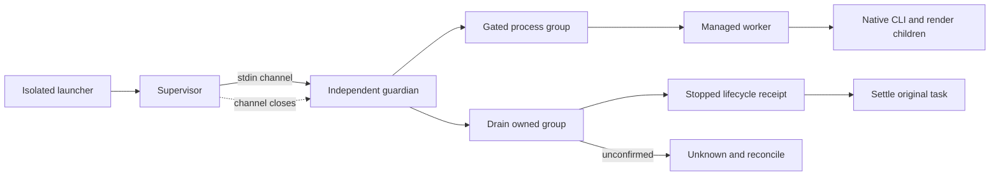

## Managed segmented recovery candidate

The macOS arm64 candidate now connects png-segmented checkpoints to public reconcile/resume. Recovery requires the same task, project, runtime, execution resources and inputs, plus confirmed owned-process termination. Only export continues; edits are not replayed. Operation IDs, deadline and lifecycle history are preserved. Repeating resume after delivery returns the existing result. Cancellation, changed bindings, corrupt context, unknown edits or missing termination proof deny continuation.

[Current evidence](evidence/managed-segment-resume-validation-20261008.json) records 212 default tests (176 passed, 36 conditionally skipped), actual exception and SIGKILL driver interruptions between segments, 12 pixel-exact frame comparisons with continuous rendering, and preserved segment bytes/inodes/mtime, project and editing receipts. The SIGKILL case does not cover killing the native CLI during active rendering. Invalid asset digests now fail before installation/output claims; native asset move/replacement regression also passes. Earlier evidence applies only to its own snapshot.

Guardian crash takeover, external GUI conflicts, complete resource metering, Web managed edits, other target systems, final host dispatch and immutable release remain open. Aggregate 9.3 and full V1 are not complete.

## Ancestor stop constraints candidate

[Component evidence](evidence/managed-ancestor-stop-component-20261008.json) binds current source. Scheduling and child creation re-read the full ancestor chain, including durable cancellation in reconciling, shortened deadlines and cycle rejection. The supervisor also checks ancestry during owned calls, persists cancellation before closing the guardian channel, and preserves attempted edits as unknown after verified termination. Three ledger failures and one actual-process failure were reproduced and fixed.

Default regression: 216 tests, 180 passed and 36 conditional skips. All 17 ledger tests, six supervisor tests with native execution enabled, and one current-source native segmented exception/resume test passed; all 15 skill resources agree. Native creation/reopen and complete decoding of 12 video frames have a separate skill-bound receipt. Earlier SIGKILL segmented evidence belongs to its earlier snapshot, not this change.

Complete frame/byte/CPU/memory accounting, review/revise ancestry-corruption coverage, guardian crash takeover, other platforms, external GUI edits, final host dispatch and immutable release remain open. Aggregate 9.3 and V1 remain open.

## Shared rendering resources candidate

Managed workflow reserves frames and decoded bytes in an internal root `effectcraft-resource-budget/v1` ledger before previews/exports. Parent and child share 10,000 frames, 64 GiB decoded data and 2 GiB encoded media; stricter existing per-sequence limits remain. Matching recovery reuses reservations. Failed attempts do not release them. Observed export media bytes are persisted as a monotonic high-water mark, including overflow before rejecting delivery. Missing legacy ledgers are diagnostic-only; dangling or corrupt reservations deny writes. Cross-record checks and updates share the store lock. Review/revise root lookup now uses cycle-checked ancestry.

[Current evidence](evidence/managed-resource-component-20261008.json): nine ledger tests; 226 default tests (189 passed, 37 conditional skips); actual parent creation and child text-change exports charged 30 frames to one root with exact media-byte accounting and original-project preservation. Single-skill native creation/reopen/complete 12-frame video decoding and segmented recovery with 12 pixel comparisons passed. All three native receipts match the current skill snapshot; all 15 resources agree.

Preview interruption before export context creation, temporary-data accounting during native SIGKILL, commands/desktop accounting, CPU/memory metering, other platforms, final host dispatch and immutable distribution remain open. Aggregate 9.3 and full V1 remain open. Earlier receipts prove only their own snapshots.

## Post-crash owned media occupancy candidate

Workflow persists `effectcraft-resource-locations/v1` before initial preview and native segment calls: directory identity, bounded publication alias and media kind. The supervisor samples registered media during execution and strictly checks it after confirmed process-tree termination; public reconcile can account original stages after worker loss. Overlapping primary/segment paths are deduplicated. Replaced or missing active directories, media links and damaged records become UNKNOWN and block further family writes. A transient live FileNotFound rename race is rechecked, never ignored after termination. Resource evidence does not settle unknown edits.

[Current component evidence](evidence/managed-resource-location-component-20261008.json): eight location tests; 235 default tests (197 passed, 38 conditional skips). Actual preview output followed by worker SIGKILL before its editing receipt was accounted through public reconcile, with original project and steps preserved and resume refusing replay. Current single-skill native creation/reopen/complete 12-frame decoding and segmented recovery passed; all three receipts match the current snapshot and all 15 resources agree. An initial test-harness pipe-close error was corrected and is not reported as a product red test.

Native SIGKILL during partial-frame writes, orphan-segment archival/recovery, guardian takeover, commands/desktop accounting, CPU/memory, other platforms/hosts and immutable publication remain open. Aggregate 9.3 and V1 remain open. Historical receipts apply only to their own snapshots.
## Orphan segment archival and retry accounting candidate

The independent skill source now journals owned unpublished segments before moving them to a private recovery location outside the successful delivery. Explicit resume requires the original task, confirmed process-tree exit, and matching project/runtime/checkpoints. Reconcile only settles the original move; it does not initiate archival or resend edits. Unknown files, links, identity conflicts, unexpected targets and move failures preserve the scene and refuse further writes. Archived media remains charged to the shared encoded-byte budget.

The compatible segmentAttempts ledger extension charges additional native attempts before launch. The first attempt is covered by the original reservation; verified segment reuse and repeated reconciliation of one attempt do not charge again. Failed consumption and overflow survive restart, and overflow prevents native launch.

[Current component evidence](evidence/managed-orphan-retry-component-20261008.json) covers nine archival tests, seven budget/integration tests, and a native case that kills the worker after four frames have been written but before segment publication. Public resume preserves archival hashes/inodes/mtimes, original editing receipts and the first segment; all twelve frames match a continuous native render, and both second-segment attempts are charged. Native creation/reopen and full twelve-frame video decoding also pass. Only bounded tasks 9.13 and 9.14 close; the fixed plugin snapshot is unchanged.

Killing the native CLI during a frame write, guardian takeover, commands/desktop and CPU/memory accounting, other platforms/hosts, and immutable distribution remain open. Task 9.3 and complete V1 remain unfinished. Earlier reports prove only their own snapshots.

## Fixed development release verification

Plugin dev.39 pins source dev.37. [Current fixed evidence](evidence/effectcraft39-fixed-managed-release-20261008.json) verifies all15 skill snapshots against the public ZIP, cold standalone launch with only the system PATH and empty Python/native caches, automatic Python3.13.16 setup, native create/save/reopen and full12-frame video decoding. Public-archive orphan recovery also passes12 continuous-render pixel comparisons. Source regression:216 passes/38 conditional skips out of254; GitHub macOS/Windows/Linux contract and nativeCLI discovery jobs pass. Earlier candidate evidence remains snapshot-specific. Other architectures, complete platform creative tasks, final host dispatch and fullV1 remain open.

## Sequence quality reinspection candidate

The source candidate recomputes ordinary and segmented sequence records, including frame indices, byte/pixel digests, alpha and rational timing. Segmented output additionally checks the original project, composition, ranges and per-segment receipts. Refreshing package hashes cannot hide a mismatch between descriptors and actual frames; unknown or incomplete descriptors produce technical FAIL. This candidate has not replaced the dev.39 locked snapshot. Full task9.4, platform and host gates remain open.

## Version reviews and best-result candidate

The task-family review ledger fixes the first criteria, reuses version request identities, makes identical imports idempotent and rejects conflicting responses. The root atomically settles stagnation and best-version selection, retaining immutable request/response/report and artifact digests. Historical scores without this ledger remain diagnostic. Fourteen targeted tests and 273 regressions (235 passed, 38 conditional skips), plus actual native local revision, passed. Codex observed a clipped title, changed only that title, and checked the revised output; engineering/technical/creative passed and user acceptance remains false. See [candidate evidence](evidence/review-ledger-candidate-20261008.json). This source candidate has not replaced the dev.39 snapshot. Full Judge scope contracts, platform/host gates and V1 remain open.

## Judge v2 and actual host observation candidate

Explicit v2 requests/receipts bind task, project/media, criteria and evaluation-scope digests. Scopes include rational timing, half-open frame ranges and requested samples. Observations bind source-media bytes, inspected frame indices and method. Missing visual/temporal capability or coverage retains NOT_RUN without scoring or stagnation charges. Legacy v1 remains diagnostic. Incomplete technical verification does not pin a partial request; the same task can review after a decoder becomes available.

Current Codex inspected five video samples before/after revision plus transparent previews, changed only the clipped title via public review/revise/review, and verified reopen/decode, non-target preservation, best-version identity and receipt idempotence. Ten contract tests, 23 ledger/revision tests and 292 regressions (254 passed, 38 conditional skips) passed. Bounded tasks9.18/9.4.3/9.4.4 are closed. Full9.4.2 still needs stale-receipt current-status CLI evidence;9.4.1/9.4 and V1 remain open. Sampled PASS is not all-frame acceptance, user acceptance is false, and no independent paid model dependency was added. Source bytes match the observed copy; the locked plugin remains dev.39. See [candidate evidence](evidence/judge-v2-candidate-20261008.json).

Task 9.4.2 public rejection diagnostics verified: 260 passed / 38 conditional skips out of 298 regressions. Current native delivery changes reject old review receipts with technical FAIL / creative NOT_RUN and preserve history/state. [Evidence](evidence/review-rejection-candidate-20261008.json).

Task 9.19 video/dependency technical component passes: 9 actual-media and 5 dependency tests; 274 passed / 38 conditional skips out of 312 regressions. Current standalone native creation, collected assets and public review negatives passed. Task 9.4.1 and fixed-release acceptance stay open; plugin dev.40 snapshot is unchanged. [Evidence](evidence/video-assets-review-candidate-20261008.json).

Current workflow engineering review uses the task-bound installed runtime, copies the native project and declared assets to an isolated temporary package, reopens it, checks missing footage and compares the exact native structure. Original hashes are verified before/after. Missing runtime/timeouts remain NOT_RUN; native/structure failures fail. Historical PASS receipts never replace current verification. revise repeats the check before spending a round. Independent userAcceptance remains NOT_RUN, with the accepted boolean preserved. Regression: 287 passed / 38 conditional skips out of 325; current standalone native creation and one sampled visual revision loop pass. Commands/desktop normalization, task 9.4.1, fixed distribution and other targets remain open. [Evidence](evidence/engineering-review-candidate-20261008.json).

## Development release dev.41 scope

This release pins source dev.39 (3552034d420df3028228df60abd07718983f7965), verified by tag, commit and all15 whole-skill digests. It includes task9.19 video/asset verification and task9.20 isolated current-project reopening. Source regression:287 passes and38 conditional skips out of325. Native/visual evidence remains scoped to the bytes bound in engineering-review-candidate-20261008.json. Earlier candidate statements about unchanged fixed releases retain their historical meaning; this section records the distribution update without claiming new host or cold-install acceptance.

FullV1 and75 tasks remain open, including equivalent commands/desktop quality review, other target platforms and final host dispatch. marketplaceEligible remainsfalse; the OpenSpec change is not archived.

## Command and desktop quality observation candidate

Scoped task9.21 passes. Managed commands and owned desktop share pre-call native snapshots, native revision IDs and actual footage hashes before/after rendering, stored only in task state. Public command plans/receipts and user outputs stay compatible. Review independently reopens every current saved project and compares all compositions/layers and isolated dependency copies; named PNGs use their own render context for actual dimensions/alpha checks. A later project cannot substitute for an unsaved render version. Uncovered outputs remain NOT_RUN.

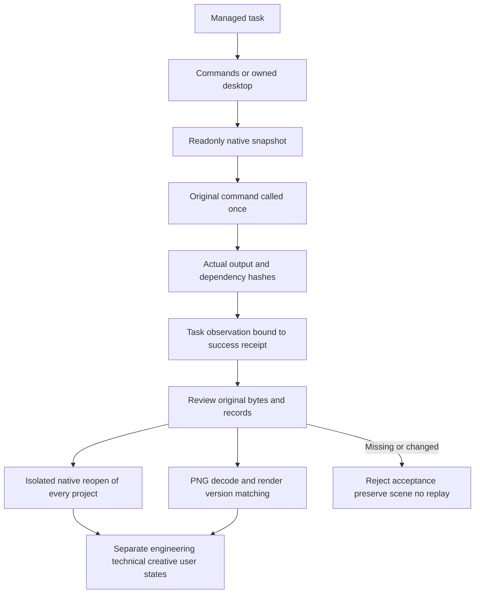

28 targeted tests and353 regressions pass with315 passes/38 conditional skips. The current standalone skill runs both public launch modes with two saved projects, two transparent PNGs and imported footage. Fourteen public-review negative cases preserve original task/output bytes; restoring test originals recovers engineering/technical PASS. Owned listener and process exit are verified. Prepared caches are reused; this is not cold-install or model-dispatch evidence. Video/sequence, Judge and automatic command revision, tasks9.3.6/9.4.1 and fullV1 remain open; creative/user acceptance remain NOT_RUN. This distribution is source dev.40/plugin dev.42; new installed-host dispatch remains unaccepted. [Candidate evidence](evidence/command-delivery-candidate-20261008.json).

## Development release dev.42

Pins source dev.40 (`ef2b4d41e1e8588bfe732717713e8be861e04e55`) through the maintained snapshot importer. All15 skill-tree digests are checked. Scoped task9.21 has current native and public rejection evidence; 75 tasks remain open. Source:315 passes/38 conditional skips. The new fixed distribution has no model-dispatch acceptance; marketplace eligibility stays false and OpenSpec stays active.

## Command and desktop Judge candidate

Managed commands/desktop reuse Judge v2 and the immutable task-family ledger, preserving public plans/receipts and original outputs. `scope.contexts` independently binds each composition/native revision/dependency identity, timebase and required samples. Media references its context; every requested path must be observed and each context must meet its own frame coverage. Missing capability/coverage stays NOT_RUN without settlement. Identical imports are idempotent; conflicting/stale receipts are rejected. Historical PASS does not replace failed current engineering/technical checks; user acceptance stays independent.

10 targeted tests and363 regressions pass:325 passes/38 conditional skips. A current standalone skill creates/saves/reopens two moving compositions through public commands and owned desktop; Codex actually views all8 bound PNGs and compares both declared times per composition, then imports the receipts publicly. Seven rejection/idempotency/current-gate checks per mode preserve originals and settled scores. Only these samples are accepted; no all-frame/interpolation claim. Scoped9.22 closes; local revise, video/sequence, fixed-host dispatch and full V1 stay open. Published source40/plugin42 snapshots are unchanged. [Evidence](evidence/command-judge-candidate-20261008.json).

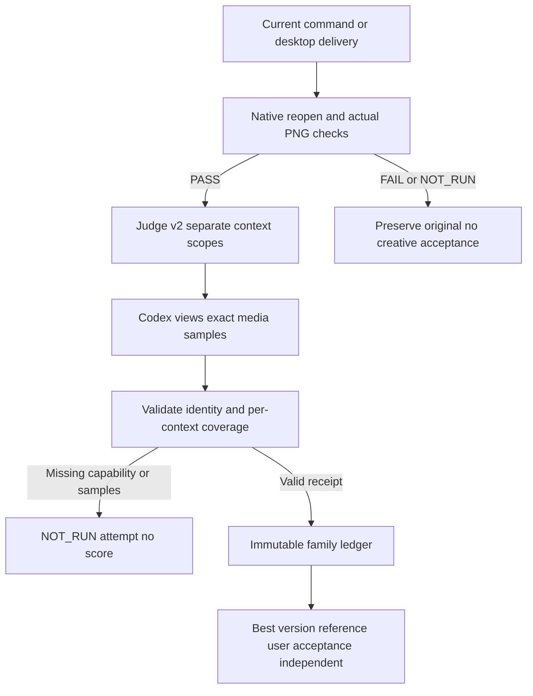

Release distribution: source dev.41 / plugin dev.43 includes task9.22. Task9.23 is specification and local work in progress only; unfinished revision code is excluded from the immutable source snapshot. Complete V1 and new fixed-host acceptance remain open.

## Scoped command revision development increment (source dev.42 / plugin dev.44)

Original tasks bind project, composition, layer and static-property scope. Revision checks current review, native gates, version and shared budget before persisting a child. Private native seeds preserve fields; verified assets relocate by digest. Text edits retain font/style. Actual rerenders, native reopening and unaffected-field/keyframe/pixel checks produce preservation receipts.

40 targeted tests; 403 regressions:365 passes,38 conditional skips. Native command visual repair passed on four multi-composition samples and one imported-asset sample. The second desktop attempt stopped after the driver timeout; missing failure receipt retains unknown state and prohibits replay. Task9.23, initial command resource accounting, cross-file settlement crash qualification, fixed-host dispatch, other platforms and V1 remain open. Public protocol ownership and existing calls remain compatible. [Evidence](evidence/command-revision-candidate-20261008.json).

## Current desktop revision and settlement recovery candidate

Three initial regressions (two failures, one error) reproduced missing-receipt diagnostics and interrupted child/root settlement. Public reconcile rechecks the immutable proof, original calls, seeds and stopped lifecycle before clearing occupation; altered proofs retain it, without refund or replay. 46 targeted tests and409 regressions pass (371 passes,38 conditional skips). Cancellation/deadline guards and forged stagnation-state rejection preserve budget and output.

A separate desktop title/imported-logo scene completed public-launch creation, actual cropped-title observation, one text-only revision, native reopen, asset relocation/digest preservation and current observed-sample creative PASS. Codex inspected both bound PNGs; user acceptance remains NOT_RUN. Seven real desktop public-entry refusal gates passed, including version/scope/expanded parameters/missing runtime/two-round/cancel/deadline. Only owned QA state was fault-injected and restored byte-for-byte. The earlier interrupted unknown task remains untouched.

Initial commands/desktop rendering is still missing full family resource accounting. Expired/cancelled settlement recovery, video/sequence revisions, fixed-host dispatch, other platforms and V1 remain open; task9.23 stays unchecked. Published plugin44/source42 snapshots are unchanged; this increment is uncommitted and unpublished. [Evidence](evidence/command-revision-recovery-candidate-20261008.json).

## Command/desktop local revision and shared PNG resources verified (candidate9.23)

Managed root plans reserve declared PNG frames before native execution. Each actual frame binds its operation digest and native decoded size before rendering. Usage takes the covering maximum of planned and actual allocations; child preallocation is not double charged. Owned directory identity, explicit media paths and encoded-byte high water survive crashes; input assets and private desktop cache are excluded. Missing legacy root accounting permits inspection but refuses automatic revision.

13 resource tests,50 revision/recovery tests and426 regressions pass (388 passes,38 conditional skips). Independent public-launch commands/owned-desktop scenes each completed observed clipping -> one text-only revision -> native reopening and material/keyframe preservation -> current sampled creative PASS. Each family records exactly4 frames/245760 decoded bytes and actual parent+child PNG encoded bytes. Codex viewed both times before/after; explicit orange-badge regions match byte-for-byte. Pixels where translucent footage composites with changed text are not asserted identical. User acceptance remains NOT_RUN; no full-sequence/interpolation or per-property native claim.

Each mode passed8 public refusal gates for binding/scope/parameters/runtime/resources/rounds/cancel/deadline, restoring owned QA fault injections exactly. Readonly settlement tests cover expiry/cancel. Current public reconcile retains the earlier expired partial desktop task as UNKNOWN, without replay/refund/output changes. Only resource_meter.validate changed after native execution, to reject corrupt dot-only media paths; current-source native/technical reinspection passed and both execution/recheck identities are retained in evidence.

Task9.23 closes only its bounded local static-PNG revision component. Full9.3/9.3.6 modes,CPU/memory,video/sequences,animated-target scope,per-command/GUI,fixed-host dispatch,other platforms andV1 remain open. Published plugin44/source42 snapshots are unchanged; this increment is uncommitted/unpublished. [Evidence](evidence/command-revision-resource-candidate-20261008.json).

## Command catalog upgrade diff candidate (2026-10-08)

The source candidate adds offline `commands.py diff BASELINE.json` to all15 independent skills. It compares command parameters, owners, workflow mappings, mode routes and native tool input schemas without installation, task registration or native editing. Added/changed contracts never inherit PASS; missing historical schemas remain NOT_RUN. Runtime/gateway changes list commands requiring revalidation. The generator rejects added, missing or duplicate reflected/native identities before writing stale documentation.

Readonly discovery of locked EffectCraft0.4.0 confirms655 commands and22 tool schemas. Comparing the published source43 catalog yields655 mode-metadata additions, not655 new native capabilities; that historical catalog lacks tool schemas. Each single-skill copy passes the public entry under a space-containing readonly path with isolated Python3.13.16 and no runtime directory; installed file hashes remain unchanged.

15 targeted tests pass after expected failures; regression441 total,403 passed/38 conditional skips. Component task9.24 is complete. Full doctor, Web/FreeBSD, every-command creative acceptance, other target platforms and fixed-host dispatch remain open. Plugin skills/ remains the released source43 snapshot; this source candidate is uncommitted/unpublished and does not change marketplace eligibility. [Evidence](evidence/command-catalog-diff-candidate-20261008.json).

## Actual readonly doctor capability candidate (2026-10-08)

Task9.2.1 is now verified: default doctor reports platform, locked/actual Python, cached CLI integrity, catalog and executable recovery argv without starting native processes or executing recovery. Explicit `doctor --probe-native` checks integrity and minimum system requirements before bounded version/tools/list/list_commands queries in its own empty headless session. Invalid baseline fails before launch; missing/corrupt/incompatible installations are preserved and never started. Timeouts are not retried and unknown tasks are not resumed.

All15 isolated skill copies pass actual readonly probing under space-containing readonly paths (CLI0.4.0,655 commands,22 tool schemas);15 no-Python calls remain readonly. Public Shell entry passes; runtime payload, unknown task records and skill hashes remain unchanged and native binary handles return to their original set.17 targeted tests and regression458 total/420 passes/38 conditional skips pass. Together with9.24 catalog evidence, task9.2.1 is checked;74 implementation tasks remain open.

Discovery PASS is limited to native version/registry/schema identity. Creative, desktop, overall target-platform and host acceptance remain NOT_RUN. Web/FreeBSD, other-platform creative tasks and fixed-host natural-language dispatch remain open. Plugin skills/ still pins released source43; the candidate is uncommitted/unpublished. The previous catalog-component doctor status describes its earlier checkpoint; this section and tasks hold the current state. [Evidence](evidence/doctor-capabilities-candidate-20261008.json).

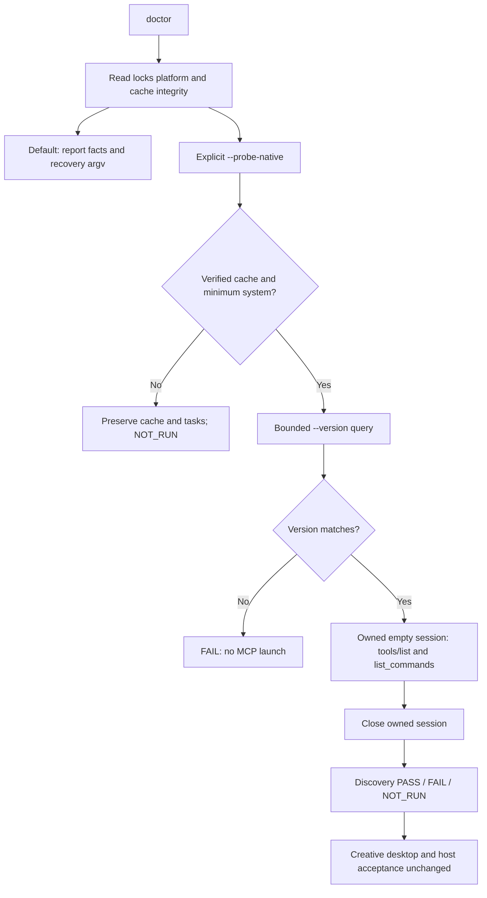

冷启动恢复补充 / Cold recovery completion: Shell及PowerShell在无Python时也报告准备隔离Python的实际入口argv，不自动执行；POSIX引号路径实测通过。PowerShell显式UTF-8避免恢复路径中文损坏，语法与实际JSON返回分支在本地PowerShell引擎通过；真实Windows主机验收仍NOT_RUN。最终证据绑定两种启动脚本及最终源码；早期456项回归是中间记录，当前有效回归为458项、420通过／38条件跳过。

## Development distribution dev.47 / source dev.44

This distribution includes the completed doctor and catalog-diff increments (9.2.1 and 9.24). Earlier candidate statements describe their checkpoints. Unfinished runtime-binding drafts are excluded. The immutable snapshot is verified independently; publication does not close the 74 remaining tasks, native platform qualification or fixed-host natural-language acceptance.

## Task execution binding candidate — 2026-10-09

Task9.25 closes task-private snapshots and original-controller recovery:24 targeted tests and482 regressions (444 passed/38 conditional skips), including15 independent entry registrations, pass. Native macOS public resume/review uses the original locked Python3.13.16/controller/EffectCraft0.4.0 after a hypothetical unavailable source-lock update, preserving identity/deadline/snapshot. A new task freezes a distinct code generation. Both projects reopen and both videos fully decode12 frames. Three public missing/corrupt/modified-snapshot refusals preserve task bytes and worker logs.

The Windows Job/EOF controller adapter has portable contract tests, not native target qualification. Two actual native release versions, global cleanup, other native platforms and installed host dispatch remain open;9.1.4 and EC-RT-002 are incomplete. Plugin skills/ remains the immutable published source45 snapshot; this candidate is uncommitted/unpublished. [Evidence](evidence/task-execution-binding-candidate-20261009.json).

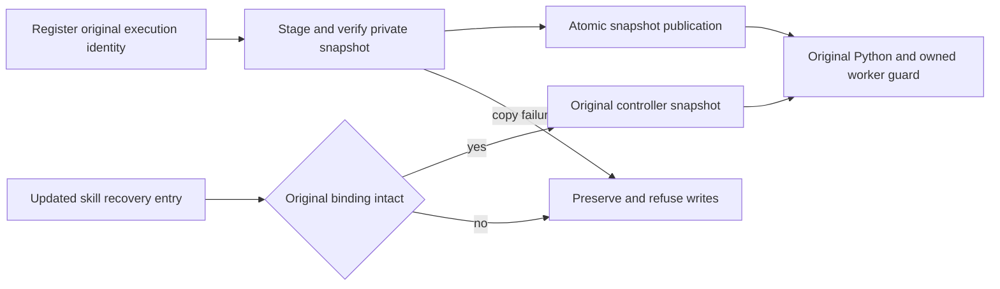

## 2026-10-09 开发发行状态 / Development release status

技能源 dev.47／插件 dev.49 纳入任务执行绑定组件9.25；此前章节的“候选未发布”和旧锁定版本仅描述各自检查点。24项绑定测试与macOS原生恢复证据对应本次执行代码，固定安装后的智能体自然语言派发验收仍开放。两个实际原生版本升级、跨状态根清理、其他目标平台及完整V1不因本次发布关闭。

Source dev.47 / plugin dev.49 includes component9.25. Earlier unpublished-candidate statements describe their historical checkpoints. Publication does not qualify installed-host dispatch, two actual native-version upgrades, global cleanup or full V1.

## 2026-10-09 真实双版本升级与安装回执 / Actual two-version upgrade and installation receipts

安装复用现在核验无歧义UTF-8回执及名称、版本、平台、官方来源、URL、归档／二进制摘要、实际版本输出与载荷锁。doctor、原生工程重开、命令交付及修订核对都传入固定版本／平台；坏回执保留现场，不下载、覆盖或改用其他版本。4项升级组件测试先出现13个目标失败断言，再转绿；7类安装失败保全旧版。完整回归486项：448通过、38条件跳过。

本机官方0.3.1（654命令／21工具的真实只读反射）与0.4.0隔离验收：旧任务的comp.new已成功登记，旧CLI仍持有可执行文件时安装新版；更新单技能文件后旧运行任务继续完成，另一个已登记未执行的旧任务通过公开resume/review完成。新任务绑定0.4.0及隔离Python3.13.16。四份原生工程独立重开与12帧视频完整解码通过，原身份／期限／快照与旧安装摘要保全，生命周期均stopped。坏新版归档另验证旧任务仍能公开恢复和交付。QA仅在旧控制器副本加入“首个图层编辑登记前暂停”门，不改变参数、回执或生产代码；首次验收脚本字段名错误保留，原生任务已正常结束，未重放未知结果。

Receipt reuse now checks unambiguous UTF-8 JSON and the pinned installation identity. Readonly doctor and native engineering/delivery/revision verification pass the pinned version and platform. Invalid receipts remain untouched. Actual macOS old0.3.1 tasks retain their frozen execution and runtime during new0.4.0 installation; old-task public recovery and new-task isolated-Python execution deliver reopened native projects and fully decoded media. Seven portable failure classes are distinguished from the actual bad-archive case.

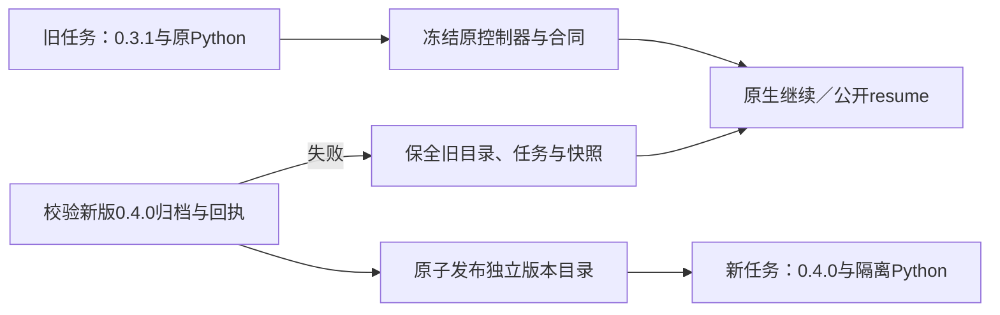

此组件不关闭9.1.4、2.4–2.6、其他目标平台或完整V1：跨状态根清理尚缺实现与证据；旧Python3.13.5仅绑定外部执行文件，不证明旧隔离标准库升级。新候选未提交／发布，插件skills/仍为不可变source47快照；安装后智能体自然语言派发尚未验收。首次暂停是受控测试边界，不等于未知编辑的可恢复证明。[证据 / Evidence](evidence/runtime-upgrade-component-candidate-20261009.json)。

## 2026-10-09 前一检查点：隔离Python双版本与入口失败 / Previous isolated-Python checkpoint

启动前新增Python安装回执校验：非链接文件、固定版本／平台／归档摘要、无额外／重复字段与非法编码；兼容旧入口生成的六种字段顺序和排版。坏回执保留，不调用解释器、不重装。4项POSIX公开入口测试先出现13个失败断言后转绿；PowerShell实际函数在本机19例通过，语法通过，真实Windows执行仍NOT_RUN。3个实际隔离Python坏回执公开doctor反例均保全回执和全部任务文件。

官方install_only制品3.13.15（20260929）和3.13.16（20261003）在同一私有Python根中依次准备。旧task的comp.new已成功、旧CLI和Python仍运行时，原子安装新Python与CLI；旧任务继续或从新技能公开resume/review后仍使用原3.13.15完整载荷与0.3.1，新任务使用3.13.16／0.4.0。两旧一新三份工程重开、12帧视频完整解码通过；原任务身份／期限／快照、旧Python整个发行与旧CLI目录保持。隔离标准库证据来自真实载荷清单及运行时核对，不再以外部Python执行文件代替。

Current launchers reject invalid Python receipts before invoking an interpreter and preserve existing files. Actual isolated3.13.15 and3.13.16 native tasks verify full distribution retention while upgrading official CLI0.3.1→0.4.0. Regression490 total:452 passes/38 conditional skips. PowerShell on macOS proves function contracts only, not nativeWindows qualification.

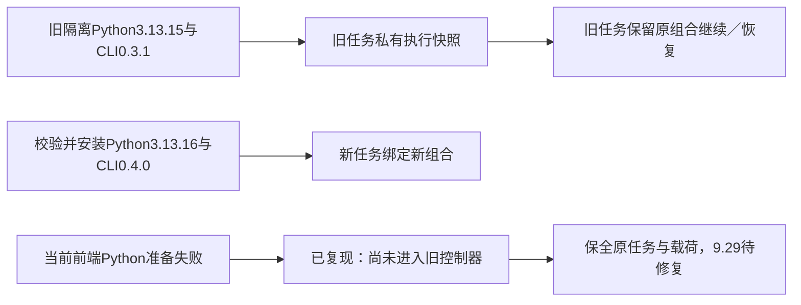

新发现的真实失败必须保留：调用已有old-held的公开resume，指定空的当前Python缓存并提供坏新制品；虽然绑定的旧3.13.15及快照完好，启动器仍先准备当前3.13.16并失败，无法进入原控制器。所有任务文件未改变、未重放编辑。这是9.29／9.1.4的未完成行为，不能用正常升级通过或本轮单元测试掩盖。后续须在当前Python安装之前选择并验证已有任务原执行资源；旧记录没有可信启动证据时保留现场，不能通过当前代码重建旧快照。跨状态根清理、其他原生平台和固定宿主仍开放。[证据 / Evidence](evidence/isolated-python-upgrade-candidate-20261009.json)。

## 2026-10-09 Bound task entry candidate

Execution binding v2 includes the digest of a fixed-field launch descriptor. Freezing atomically publishes the original identity JSON, descriptor and complete skill snapshot. POSIX and PowerShell entry points select existing tasks before reading or preparing the current Python lock. They verify the top-level task identity, original platform and minimum system, Python receipt and complete distribution, then invoke only the current package's readonly dispatcher. The dispatcher rechecks authoritative state and the complete original snapshot before handing off the original controller and runtimeHome. POSIX preserves PID through exec; Windows retains the owned Job and stdin supervision channel. V1 bindings remain readable and resolvable with an existing Python; missing launch materials are never implicitly rebuilt or migrated.

Actual macOS evidence: an isolated Python3.13.15 / EffectCraft0.3.1 task resumes with an empty current Python cache, bad current archive and corrupt current Python lock. Native project reopening and full12-frame decoding pass. Original identity, deadline, completed operations and frozen resources remain unchanged; the original runtimeHome replaces the incorrect frontend argument. A bad original Python receipt rejects before interpreter execution. The final frontend also passes readonly native reopening and decoding against the retained earlier task snapshot. A new final-source task uses isolated3.13.16 / CLI0.4.0 and passes the same checks.

Validation: 13 targeted tests, including8 actual PowerShell identity-function cases;19 receipt-function cases on macOS. Full source regression504 total:466 passed /38 conditional skips. PowerShell syntax and function tests do not establish native Windows entry or process termination acceptance. Only component9.29.1 is checked;9.29,9.1.4, cross-state-root retention/cleanup, other targets, fixed installed-host dispatch and fullV1 remain open. Candidate is unpublished; the plugin still pins source48. [Evidence](evidence/task-bound-entry-candidate-20261009.json).

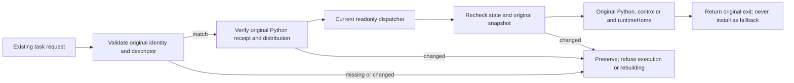

## Offline sandbox process-group confirmation

The unpublished candidate probes the original owned process group under its task lifecycle lease with signal0, which sends no termination signal. A missing group proves it is empty without invoking ps. Existing groups and EPERM still require valid member evidence; failed inspection keeps unknown. Ten targeted tests and516 regressions (478 passes/38 conditional skips) pass on macOS, including actual network-denied sandbox exit and descendant cleanup. The original unknown task retains all93 files and reconcile still rejects it. Native Windows/other POSIX targets, fixed hosts and fullV1 stay open. [Evidence](evidence/process-group-probe-candidate-20261009.json).

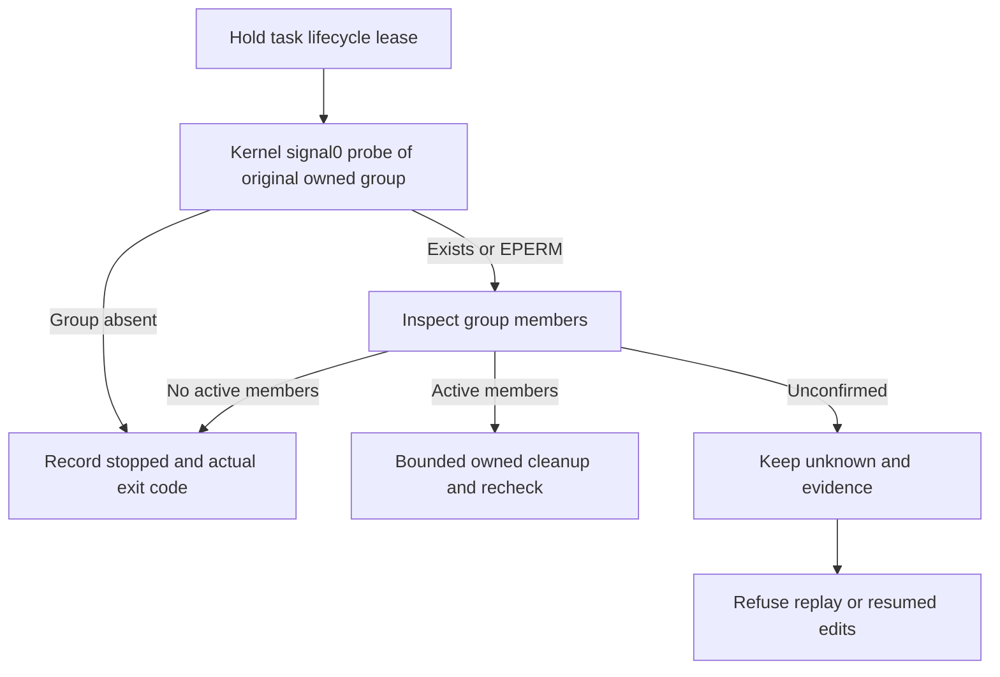

## Fifteen independent readonly offline skills

Task9.5.1 passes on macOS arm64:15 installs each contain one skill, use paths with spaces and remain readonly. The OS denies network, developer-workspace reads and system Python execution. Public run/review, native project reopen and actual12-frame decode (320×180,12fps,1second) pass for every skill. All installed content matches current source; readonly modes are preserved, every lifecycle is stopped and no CLI process remains.

The first case installs from cold Python/native caches using prepared official archives;14 cases reuse the verified shared user cache. This is not15 cold installs. ffmpeg/ffprobe are preinstalled prerequisites; automatic media-tool installation is not qualified. Creative/user acceptance remains NOT_RUN. Domain tasks/transparent FilmCraft handoff9.5.2, other targets9.1.2, fixed hosts and fullV1 stay open. This candidate is unpublished and candidateCI is NOT_RUN. [Evidence](evidence/independent-offline15-candidate-20261009.json).

## POSIX ownership release dev.51 / plugin dev.53

Development source dev.51 / plugin dev.53: POSIX private group ownership and nonce-bound business results cover guardian loss, orphan descendants and forced cancellation. Current regression and offline installed-copy evidence: [release validation](evidence/group-ownership-release51-20261009.json). Historical checkpoints below retain their original fingerprints; cross-platform native, fixed-host, creative acceptance and full V1 remain open.

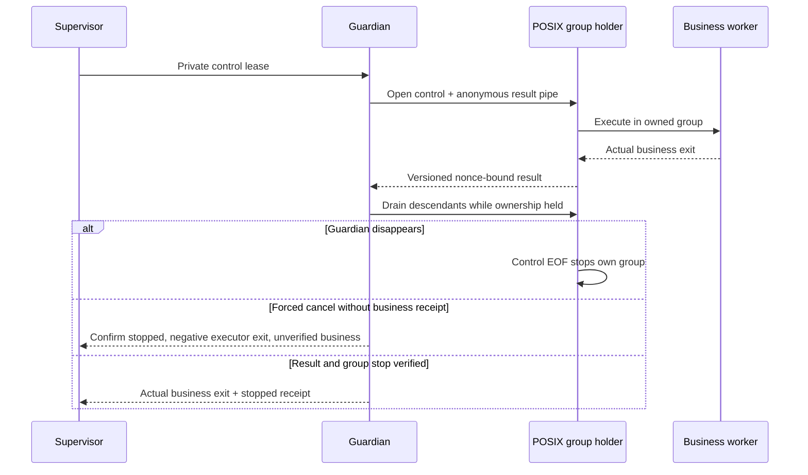

## Cancellation after controller restart

Unpublished cancellation-recovery candidate beyond source51/plugin53: active startup leases retain cancel_requested; restart reconciliation confirms the original stopped lifecycle and preserves unknown edits. A versioned process-exit record separates forced group stop from a verified business exit. 12 targeted tests, 536 regressions (498 passes / 38 conditional skips), and a current readonly installed-skill native cancellation/crash/reconciliation case pass. Published snapshots stay unchanged; full task-family cancellation, other platforms, hosts and V1 remain open. [Evidence](evidence/cancel-restart-candidate-20261009.json).

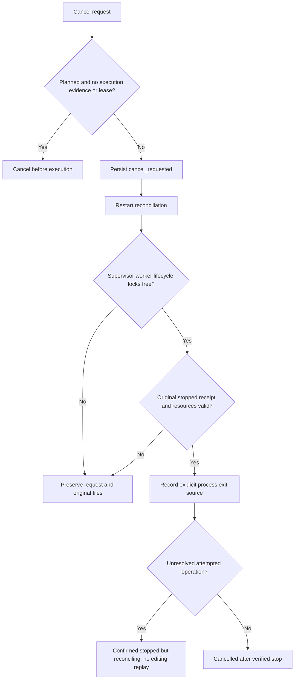

Cancellation family barrier (development source52/plugin54): persist root intent and descendant identities first. Active descendants or missing stop proof retain cancel_requested; original controllers reconcile children, and unknown edits retain parent reconciling. Not-started proof is captured only at original cancellation under all execution leases. 27 cancellation tests and real macOS native parent/child crash recovery pass; complete crash/GUI matrix, other native platforms, fixed hosts and V1 remain open. Evidence: `docs/evidence/cancel-family-candidate-20261009.json`.

## Source changes while a task runs

The current task9.3.2 candidate checks the bound source digest at start, before each new operation intent and before delivery. External saves, missing/unreadable files and link replacements raise revision_conflict without sending the next edit. Existing receipts, identity and the user's new source remain intact. See [candidate evidence](evidence/source-revision-conflict-candidate-20261009.json) for an actual independent native save. In-memory GUI changes, complete session competition, cross-state-root single-writer and other platforms remain open. The published plugin snapshot is unchanged.

## Project ownership across task stores

New tasks claim canonical source paths and file objects in a shared user directory. Changing the state root, task ID, output or hardlink alias cannot bypass active ownership. Claims bind the original store and task identity; missing/corrupt/unknown owners are preserved rather than cleared by PID disappearance or timeout. Historical tasks receive no synthesized proof. In-memory GUI changes and parallel legacy runtimes remain open. See [shared project candidate evidence](evidence/shared-project-claims-candidate-20261009.json).

File-generation repair candidate: source claims now bind creation time with the file number, preserve legacy unconfirmed claims and reject unavailable creation identity. Linux uses verified-descriptor statx; native birth time is used elsewhere. [Evidence](evidence/project-creation-generation-candidate-20261009.json) distinguishes local container contracts from pinned Python, native creative and host gates. Source57/plugin59 remain the immutable published baseline;9.3.2 remains open.

Local desktop revision candidate: owned managed sessions persist project/editor context and atomically guard execute_command, batch, open/save and run_script. Unmapped helpers are refused before sending; confirmed read tools are checked again afterward. [Evidence](evidence/desktop-native-revision-candidate-20261009.json) separates native mapping, owned desktop control edits and installed public-entry checks from model dispatch and physical GUI input. Old published snapshots remain unchanged; full9.3.2 and V1 remain open.

Desktop atomic-conflict reconciliation candidate: `docs/evidence/desktop-conflict-reconcile-candidate-20261009.json`. Versioned proofs bind the task, operation arguments, original session baseline and stopped owned desktop. Public reconcile/resume can identify an individual operation as not executed while preserving attempted intents and successful receipts. Legacy proofs, non-atomic changes and missing stop evidence remain unknown; unresolved tasks block replacement task IDs. This increment is unpublished; full 9.3.3/9.3.4 and V1 remain open.

source59／plugin61开发发行新增版本化命令完成证明，在核对全部原结果、停止身份、原生工程副本和实际媒体后只补齐交付登记；取消或材料变化不发布迟到结果。完整崩溃、普通编辑恢复及V1仍开放。当前验证见[发行证据](evidence/release59-validation-20261009.json)。

Local real-process fault candidate (9.35): commands and owned desktop cover SIGKILL before the completion proof, after the proof but before its reference, and after both are durable. Missing or orphan proofs cannot be adopted; a complete original proof permits delivery registration only after verified process stop, isolated native reopen and actual PNG decode, preserving original files, receipts and budgets. Malformed ownership now returns structured failure while absent non-POSIX fields retain compatibility. See [candidate evidence](evidence/command-completion-crash-candidate-20261009.json). Other native targets, full 9.3.3/9.3.4 and V1 remain open.

Local native family cancellation acceptance (9.36): commands and owned desktop cover normal ancestor cancellation and supervisor SIGKILL after durable intent. Original frozen public entries reconcile the child before the parent; the unrecorded save response stays unknown. Native files/media, successful receipts, deadlines/revision budgets, shared resources and unrelated processes are preserved. Four native cases and 27 cancellation contracts pass; four native cases skip by default. [Evidence](evidence/native-family-cancellation-candidate-20261009.json) preserves fixture corrections and limits: registered undispatched parent, reused cache, Python3.13.5 and macOS arm64 only. Production code and published source60/plugin62 snapshots are unchanged; new tests/evidence remain unpublished candidates. Full9.3.4 and 70 V1 tasks stay open.

Technical gate9.4.1 accepted: [evidence](evidence/technical-gate-acceptance-20261009.json). Asset-bearing MP4, ordinary transparent and segmented sequences complete public plan/run/review/resume from one readonly independent skill, including native save/reopen and actual decoding. Isolated real-delivery mutants with invalid video, missing assets or invalid project fail; a high-score receipt cannot override technical failure. Six native positive/negative cases pass; targeted regression72 pass/6 conditional skip (78 total). Engineering, media technical, creative and user acceptance remain separate; the latter two are NOT_RUN. Acceptance is macOS arm64 with isolated Python3.13.16 and reused verified caches; other targets, model dispatch and all-command output qualification remain open. V1 has69 open tasks. Published source60/plugin62 production snapshots are unchanged; new acceptance is unpublished.

技能源dev.61／插件dev.63发布9.36与9.4.1验收增量；此前未发布候选陈述为各自历史检查点。当前69项V1任务开放，执行资源与source60字节一致。 / Source dev.61 and plugin dev.63 publish the9.36 and9.4.1 acceptance increments. Earlier candidate statements retain historical scope.69 V1 tasks remain open; execution resources are unchanged from source60.

Local artifact-lineage candidate (EC-AR-001;5.1–5.3 in progress): workflows add the ArtCraft-owned craft-artifact/v1 object to the compatible manifest, binding logical identity, immutable whole-package version, actual task, parent version, native project, renditions and collected media. Review and moved-source revision verify every bound file; same-name replacement, stale versions, reference mismatches and links are rejected. Source-package binding persists in task authorization and is checked before subsequent edits and delivery. Direct CLI execution explicitly uses standalone identity; legacy packages contribute content-verifiable native references without invented task provenance. This is unpublished source work; the plugin remains pinned to released source61. Command/desktop public artifact mapping, font/LUT discovery and complete fixed-release protocol qualification remain open;5.1–5.3 are not checked off.

Unpublished source-producer guard: copying/moving a managed workflow package or changing state roots still requires original task, operation receipts, durable delivery digest and stopped-process evidence. A private user-level locator is not completion proof; each edit intent and delivery rechecks the persisted source binding. Ten targeted tests and708 regression cases pass (643 passed,65 conditional skips). Native SIGKILL after package completion but before ledger delivery confirms public cross-store plan/run refusal, original reconcile/resume without replay, and confirmed moved-source revision with native reopen/PNG checks. The first native fixture ordering failure is retained. macOS arm64 and reused caches only; full9.3.3, legacy/command/desktop matrices, other platforms and hosts remain open, with69 tasks unfinished. Plugin stays pinned to source62/plugin64. 证据 `docs/evidence/source-producer-guard-candidate-20261009.json`。

Source dev.63 / plugin dev.65 distributes source-producer guards and public artifacts for commands and owned desktop sessions: separate projects retain actual task identity, immutable package versions, native projects, matching PNGs and media dependencies. Legacy delivery remains readable. Portable mapping does not replace technical, creative or user acceptance. Prior candidates retain their observation-time scope; see [release validation](evidence/release63-validation-20261009.json). Font/LUT discovery, complete fault matrices, other native platforms and fixed-host dispatch remain open;5.1–5.3 remain unchecked and V1 has69 unfinished tasks.
