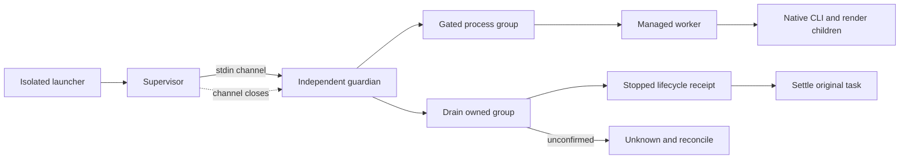
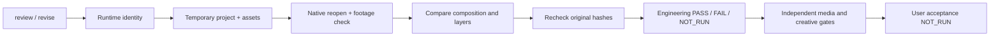
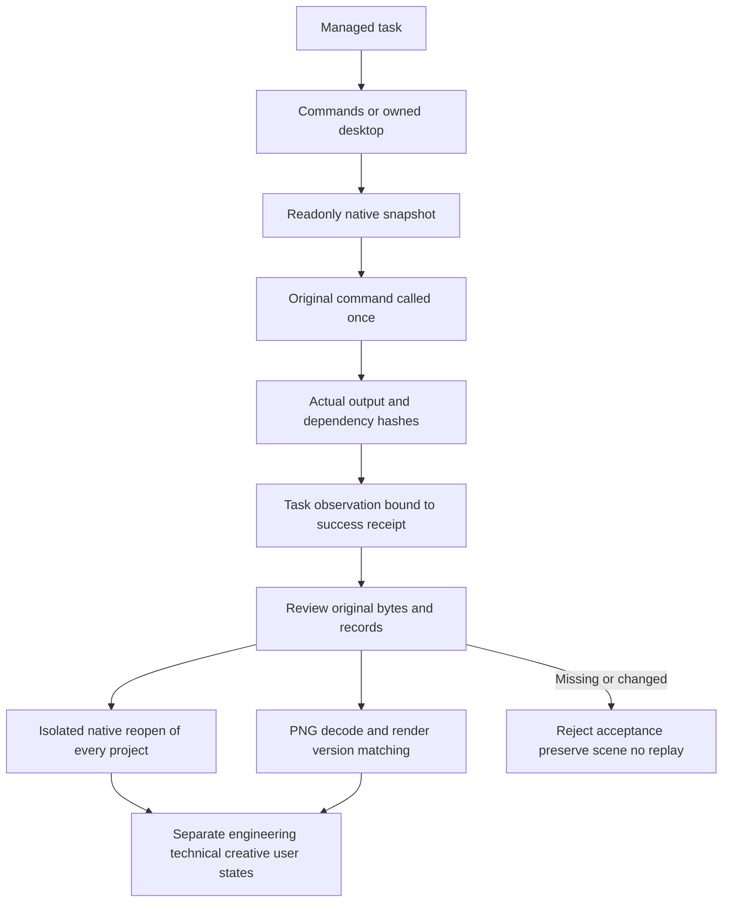
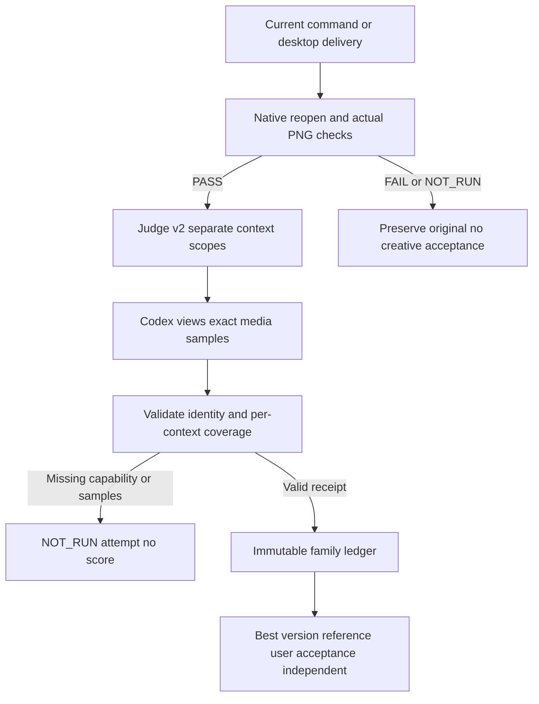

# EffectCraft optimization candidate

Plugin dev.39 consumes the immutable dev.37 skill source recorded in skills.lock.json. Earlier candidate reports below retain their own snapshot identities. This change updates the existing establish-v1-plugin specification, traceability, and source-candidate validator. The source tag and commit are verified before vendoring; complete platform/host qualification remains open.

The independent skills repository owns the isolated Python bootstrap, seven pinned native artifacts, durable managed tasks, artifact review and bounded revisions. The pinned 0.4.0 catalog contains 655 commands; new commands remain NOT_RUN until exercised.

See [candidate evidence](evidence/managed-optimization-20261008.json), [source validation](evidence/managed-source-candidate-20261008.json), and [alpha handoff](evidence/managed-alpha-handoff-20261008.json). macOS arm64 native scenes and one Codex natural-language creation/revision delivery were exercised. The evidence records differences between that installed host snapshot and later validation hardening.

Segmented recovery has bounded local candidate evidence below. Open implementation: process ownership across supervisor restart, external GUI editing conflicts, complete resource metering, and Web managed editing. Open environment gates: other native OS/architecture combinations, FreeBSD build, Web GPU failure, and other hosts. Full V1 and aggregate tasks 9.1–9.6 remain open.

Run `python3 scripts/verify_candidate.py --source /absolute/effectcraft-skills --report /tmp/candidate.json`. Source publication, immutable plugin vendoring and marketplace updates require separate release authorization and never replace native acceptance.

## Pre-start failure and first-use evidence

The supervisor now observes the real worker exit code and records it in the same durable task. A worker exiting before running with no attempted steps becomes failed and the public CLI returns failure. Attempted steps with uncertain effects remain reconciling. Successful and cancelled terminal states are preserved. Worker exit alone does not prove that all native descendants stopped.

[Component evidence](evidence/managed-supervisor-component-20261008.json) binds the exact candidate skill files. The real source-project conflict regression and four targeted tests pass; the source suite has 163 passes and 34 conditional skips out of 197. A project skill copied alone installed Python3.13.16 and EffectCraft0.4.0 from empty runtime directories under the system PATH, then completed20 durable steps including creation, save/reopen and export. Independent decoding confirms320×180,12fps and12 frames; delivery and skill checksums match.

Only candidate component task9.7 is complete. Aggregate9.3, fixed publication, final host acceptance, all15 candidate cold starts and creative approval remain open. This evidence changes neither the released dev.34 source identity nor vendored plugin skills.

Additional evidence: [15 independent first uses](evidence/managed-candidate-all15-first-use-20261008.json). Fourteen skills each installed isolated Python and native CLI from public releases and verified versions and the655-command live catalog. The project skill separately completed a cold managed creation/reopen/export. All15 match current candidate identities and preserve skill files. This is macOS arm64 source-candidate evidence only;15 creative scenarios, final host, fixed publication and aggregate9.5 remain open. The dark sample title has low contrast against the black background, so creative review remains required.

## Default intro readability correction

[Current candidate evidence](evidence/managed-readable-intro-20261008.json) records a lighter title in the default example. The real video decoding assertion first failed with zero bright title pixels, then passed after the correction. Native text revision also preserved the badge, transparent first frame and opacity keyframes.

The corrected project skill was copied alone and installed Python and the native CLI from empty runtime directories. It completed 20 durable creation/save/reopen/export steps. Independent full decoding confirms 320×180, 12 fps and 12 frames; 540 title pixels exceed the test threshold. The preview was inspected. Full creative and user approval remain separate gates.

Only shared brand-intro.json changed across the 15 skills; execution resources remain byte-identical. Replacing its digest with the previous example digest reconstructs every saved whole-skill identity. Previous raw cold-case directories are no longer present; summary evidence remains historical. Only one corrected skill cold creation was rerun. Fixed publication, final host acceptance and aggregate tasks 9.4/9.5 remain open.

The subsequent live-source audit failed: canonical process_guard.py was added without synchronization to the other 14 skills. Concurrent work is preserved. Readability evidence proves the captured copied snapshot only and does not qualify later source edits or the whole candidate for release.

## Independent-skill guard and cold-start integration evidence

[Integration evidence](evidence/managed-process-guard-integration-20261008.json) supplements component9.8. All15 skills were copied individually into paths with spaces. Public resume calls rejected source conflicts with durable failed tasks and stopped lifecycle receipts. The same check failed against the older copied skill because it lacked process-tree termination evidence. Managed, process_guard and task_store resources match across all15 skills.

The current default suite has167 passes and35 conditional skips out of202 tests. A fresh project skill installed isolated Python and the native CLI under the system PATH, then completed20 creation steps. Reopen, full12-frame video decoding, matching source/copy identity and unchanged skill files passed. The lifecycle receipt records stopped with exit0; independent group inspection found no executing members.

The first attempt failed during temporary disk exhaustion:22 test errors and Python download exit56. Failure logs remain separate. After terminal processes and restored space were confirmed, installation was retried in a new empty directory. Windows and other platforms, guardian-crash takeover, segmented recovery, final host and fixed publication remain open. The diagram describes the verified local chain; unconfirmed termination requires reconciliation.

## Managed segmented recovery candidate

The macOS arm64 candidate now connects png-segmented checkpoints to public reconcile/resume. Recovery requires the same task, project, runtime, execution resources and inputs, plus confirmed owned-process termination. Only export continues; edits are not replayed. Operation IDs, deadline and lifecycle history are preserved. Repeating resume after delivery returns the existing result. Cancellation, changed bindings, corrupt context, unknown edits or missing termination proof deny continuation.

[Current evidence](evidence/managed-segment-resume-validation-20261008.json) records 212 default tests (176 passed, 36 conditionally skipped), actual exception and SIGKILL driver interruptions between segments, 12 pixel-exact frame comparisons with continuous rendering, and preserved segment bytes/inodes/mtime, project and editing receipts. The SIGKILL case does not cover killing the native CLI during active rendering. Invalid asset digests now fail before installation/output claims; native asset move/replacement regression also passes. Earlier evidence applies only to its own snapshot.

Guardian crash takeover, external GUI conflicts, complete resource metering, Web managed edits, other target systems, final host dispatch and immutable release remain open. Aggregate 9.3 and full V1 are not complete.

## Ancestor stop constraints candidate

[Component evidence](evidence/managed-ancestor-stop-component-20261008.json) binds current source. Scheduling and child creation re-read the full ancestor chain, including durable cancellation in reconciling, shortened deadlines and cycle rejection. The supervisor also checks ancestry during owned calls, persists cancellation before closing the guardian channel, and preserves attempted edits as unknown after verified termination. Three ledger failures and one actual-process failure were reproduced and fixed.

Default regression: 216 tests, 180 passed and 36 conditional skips. All 17 ledger tests, six supervisor tests with native execution enabled, and one current-source native segmented exception/resume test passed; all 15 skill resources agree. Native creation/reopen and complete decoding of 12 video frames have a separate skill-bound receipt. Earlier SIGKILL segmented evidence belongs to its earlier snapshot, not this change.

Complete frame/byte/CPU/memory accounting, review/revise ancestry-corruption coverage, guardian crash takeover, other platforms, external GUI edits, final host dispatch and immutable release remain open. Aggregate 9.3 and V1 remain open.

## Shared rendering resources candidate

Managed workflow reserves frames and decoded bytes in an internal root `effectcraft-resource-budget/v1` ledger before previews/exports. Parent and child share 10,000 frames, 64 GiB decoded data and 2 GiB encoded media; stricter existing per-sequence limits remain. Matching recovery reuses reservations. Failed attempts do not release them. Observed export media bytes are persisted as a monotonic high-water mark, including overflow before rejecting delivery. Missing legacy ledgers are diagnostic-only; dangling or corrupt reservations deny writes. Cross-record checks and updates share the store lock. Review/revise root lookup now uses cycle-checked ancestry.

[Current evidence](evidence/managed-resource-component-20261008.json): nine ledger tests; 226 default tests (189 passed, 37 conditional skips); actual parent creation and child text-change exports charged 30 frames to one root with exact media-byte accounting and original-project preservation. Single-skill native creation/reopen/complete 12-frame video decoding and segmented recovery with 12 pixel comparisons passed. All three native receipts match the current skill snapshot; all 15 resources agree.

Preview interruption before export context creation, temporary-data accounting during native SIGKILL, commands/desktop accounting, CPU/memory metering, other platforms, final host dispatch and immutable distribution remain open. Aggregate 9.3 and full V1 remain open. Earlier receipts prove only their own snapshots.

## Post-crash owned media occupancy candidate

Workflow persists `effectcraft-resource-locations/v1` before initial preview and native segment calls: directory identity, bounded publication alias and media kind. The supervisor samples registered media during execution and strictly checks it after confirmed process-tree termination; public reconcile can account original stages after worker loss. Overlapping primary/segment paths are deduplicated. Replaced or missing active directories, media links and damaged records become UNKNOWN and block further family writes. A transient live FileNotFound rename race is rechecked, never ignored after termination. Resource evidence does not settle unknown edits.

[Current component evidence](evidence/managed-resource-location-component-20261008.json): eight location tests; 235 default tests (197 passed, 38 conditional skips). Actual preview output followed by worker SIGKILL before its editing receipt was accounted through public reconcile, with original project and steps preserved and resume refusing replay. Current single-skill native creation/reopen/complete 12-frame decoding and segmented recovery passed; all three receipts match the current snapshot and all 15 resources agree. An initial test-harness pipe-close error was corrected and is not reported as a product red test.

Native SIGKILL during partial-frame writes, orphan-segment archival/recovery, guardian takeover, commands/desktop accounting, CPU/memory, other platforms/hosts and immutable publication remain open. Aggregate 9.3 and V1 remain open. Historical receipts apply only to their own snapshots.
## Orphan segment archival and retry accounting candidate

The independent skill source now journals owned unpublished segments before moving them to a private recovery location outside the successful delivery. Explicit resume requires the original task, confirmed process-tree exit, and matching project/runtime/checkpoints. Reconcile only settles the original move; it does not initiate archival or resend edits. Unknown files, links, identity conflicts, unexpected targets and move failures preserve the scene and refuse further writes. Archived media remains charged to the shared encoded-byte budget.

The compatible segmentAttempts ledger extension charges additional native attempts before launch. The first attempt is covered by the original reservation; verified segment reuse and repeated reconciliation of one attempt do not charge again. Failed consumption and overflow survive restart, and overflow prevents native launch.

[Current component evidence](evidence/managed-orphan-retry-component-20261008.json) covers nine archival tests, seven budget/integration tests, and a native case that kills the worker after four frames have been written but before segment publication. Public resume preserves archival hashes/inodes/mtimes, original editing receipts and the first segment; all twelve frames match a continuous native render, and both second-segment attempts are charged. Native creation/reopen and full twelve-frame video decoding also pass. Only bounded tasks 9.13 and 9.14 close; the fixed plugin snapshot is unchanged.

Killing the native CLI during a frame write, guardian takeover, commands/desktop and CPU/memory accounting, other platforms/hosts, and immutable distribution remain open. Task 9.3 and complete V1 remain unfinished. Earlier reports prove only their own snapshots.

## Fixed development release verification

Plugin dev.39 pins source dev.37. [Current fixed evidence](evidence/effectcraft39-fixed-managed-release-20261008.json) verifies all15 skill snapshots against the public ZIP, cold standalone launch with only the system PATH and empty Python/native caches, automatic Python3.13.16 setup, native create/save/reopen and full12-frame video decoding. Public-archive orphan recovery also passes12 continuous-render pixel comparisons. Source regression:216 passes/38 conditional skips out of254; GitHub macOS/Windows/Linux contract and nativeCLI discovery jobs pass. Earlier candidate evidence remains snapshot-specific. Other architectures, complete platform creative tasks, final host dispatch and fullV1 remain open.

## Sequence quality reinspection candidate

The source candidate recomputes ordinary and segmented sequence records, including frame indices, byte/pixel digests, alpha and rational timing. Segmented output additionally checks the original project, composition, ranges and per-segment receipts. Refreshing package hashes cannot hide a mismatch between descriptors and actual frames; unknown or incomplete descriptors produce technical FAIL. This candidate has not replaced the dev.39 locked snapshot. Full task9.4, platform and host gates remain open.

## Version reviews and best-result candidate

The task-family review ledger fixes the first criteria, reuses version request identities, makes identical imports idempotent and rejects conflicting responses. The root atomically settles stagnation and best-version selection, retaining immutable request/response/report and artifact digests. Historical scores without this ledger remain diagnostic. Fourteen targeted tests and 273 regressions (235 passed, 38 conditional skips), plus actual native local revision, passed. Codex observed a clipped title, changed only that title, and checked the revised output; engineering/technical/creative passed and user acceptance remains false. See [candidate evidence](evidence/review-ledger-candidate-20261008.json). This source candidate has not replaced the dev.39 snapshot. Full Judge scope contracts, platform/host gates and V1 remain open.

## Judge v2 and actual host observation candidate

Explicit v2 requests/receipts bind task, project/media, criteria and evaluation-scope digests. Scopes include rational timing, half-open frame ranges and requested samples. Observations bind source-media bytes, inspected frame indices and method. Missing visual/temporal capability or coverage retains NOT_RUN without scoring or stagnation charges. Legacy v1 remains diagnostic. Incomplete technical verification does not pin a partial request; the same task can review after a decoder becomes available.

Current Codex inspected five video samples before/after revision plus transparent previews, changed only the clipped title via public review/revise/review, and verified reopen/decode, non-target preservation, best-version identity and receipt idempotence. Ten contract tests, 23 ledger/revision tests and 292 regressions (254 passed, 38 conditional skips) passed. Bounded tasks9.18/9.4.3/9.4.4 are closed. Full9.4.2 still needs stale-receipt current-status CLI evidence;9.4.1/9.4 and V1 remain open. Sampled PASS is not all-frame acceptance, user acceptance is false, and no independent paid model dependency was added. Source bytes match the observed copy; the locked plugin remains dev.39. See [candidate evidence](evidence/judge-v2-candidate-20261008.json).

Task 9.4.2 public rejection diagnostics verified: 260 passed / 38 conditional skips out of 298 regressions. Current native delivery changes reject old review receipts with technical FAIL / creative NOT_RUN and preserve history/state. [Evidence](evidence/review-rejection-candidate-20261008.json).

Task 9.19 video/dependency technical component passes: 9 actual-media and 5 dependency tests; 274 passed / 38 conditional skips out of 312 regressions. Current standalone native creation, collected assets and public review negatives passed. Task 9.4.1 and fixed-release acceptance stay open; plugin dev.40 snapshot is unchanged. [Evidence](evidence/video-assets-review-candidate-20261008.json).

Current workflow engineering review uses the task-bound installed runtime, copies the native project and declared assets to an isolated temporary package, reopens it, checks missing footage and compares the exact native structure. Original hashes are verified before/after. Missing runtime/timeouts remain NOT_RUN; native/structure failures fail. Historical PASS receipts never replace current verification. revise repeats the check before spending a round. Independent userAcceptance remains NOT_RUN, with the accepted boolean preserved. Regression: 287 passed / 38 conditional skips out of 325; current standalone native creation and one sampled visual revision loop pass. Commands/desktop normalization, task 9.4.1, fixed distribution and other targets remain open. [Evidence](evidence/engineering-review-candidate-20261008.json).

## Development release dev.41 scope

This release pins source dev.39 (3552034d420df3028228df60abd07718983f7965), verified by tag, commit and all15 whole-skill digests. It includes task9.19 video/asset verification and task9.20 isolated current-project reopening. Source regression:287 passes and38 conditional skips out of325. Native/visual evidence remains scoped to the bytes bound in engineering-review-candidate-20261008.json. Earlier candidate statements about unchanged fixed releases retain their historical meaning; this section records the distribution update without claiming new host or cold-install acceptance.

FullV1 and75 tasks remain open, including equivalent commands/desktop quality review, other target platforms and final host dispatch. marketplaceEligible remainsfalse; the OpenSpec change is not archived.

## Command and desktop quality observation candidate

Scoped task9.21 passes. Managed commands and owned desktop share pre-call native snapshots, native revision IDs and actual footage hashes before/after rendering, stored only in task state. Public command plans/receipts and user outputs stay compatible. Review independently reopens every current saved project and compares all compositions/layers and isolated dependency copies; named PNGs use their own render context for actual dimensions/alpha checks. A later project cannot substitute for an unsaved render version. Uncovered outputs remain NOT_RUN.

28 targeted tests and353 regressions pass with315 passes/38 conditional skips. The current standalone skill runs both public launch modes with two saved projects, two transparent PNGs and imported footage. Fourteen public-review negative cases preserve original task/output bytes; restoring test originals recovers engineering/technical PASS. Owned listener and process exit are verified. Prepared caches are reused; this is not cold-install or model-dispatch evidence. Video/sequence, Judge and automatic command revision, tasks9.3.6/9.4.1 and fullV1 remain open; creative/user acceptance remain NOT_RUN. This distribution is source dev.40/plugin dev.42; new installed-host dispatch remains unaccepted. [Candidate evidence](evidence/command-delivery-candidate-20261008.json).

## Development release dev.42

Pins source dev.40 (`ef2b4d41e1e8588bfe732717713e8be861e04e55`) through the maintained snapshot importer. All15 skill-tree digests are checked. Scoped task9.21 has current native and public rejection evidence; 75 tasks remain open. Source:315 passes/38 conditional skips. The new fixed distribution has no model-dispatch acceptance; marketplace eligibility stays false and OpenSpec stays active.

## Command and desktop Judge candidate

Managed commands/desktop reuse Judge v2 and the immutable task-family ledger, preserving public plans/receipts and original outputs. `scope.contexts` independently binds each composition/native revision/dependency identity, timebase and required samples. Media references its context; every requested path must be observed and each context must meet its own frame coverage. Missing capability/coverage stays NOT_RUN without settlement. Identical imports are idempotent; conflicting/stale receipts are rejected. Historical PASS does not replace failed current engineering/technical checks; user acceptance stays independent.

10 targeted tests and363 regressions pass:325 passes/38 conditional skips. A current standalone skill creates/saves/reopens two moving compositions through public commands and owned desktop; Codex actually views all8 bound PNGs and compares both declared times per composition, then imports the receipts publicly. Seven rejection/idempotency/current-gate checks per mode preserve originals and settled scores. Only these samples are accepted; no all-frame/interpolation claim. Scoped9.22 closes; local revise, video/sequence, fixed-host dispatch and full V1 stay open. Published source40/plugin42 snapshots are unchanged. [Evidence](evidence/command-judge-candidate-20261008.json).

Release distribution: source dev.41 / plugin dev.43 includes task9.22. Task9.23 is specification and local work in progress only; unfinished revision code is excluded from the immutable source snapshot. Complete V1 and new fixed-host acceptance remain open.

## Scoped command revision development increment (source dev.42 / plugin dev.44)

Original tasks bind project, composition, layer and static-property scope. Revision checks current review, native gates, version and shared budget before persisting a child. Private native seeds preserve fields; verified assets relocate by digest. Text edits retain font/style. Actual rerenders, native reopening and unaffected-field/keyframe/pixel checks produce preservation receipts.

40 targeted tests; 403 regressions:365 passes,38 conditional skips. Native command visual repair passed on four multi-composition samples and one imported-asset sample. The second desktop attempt stopped after the driver timeout; missing failure receipt retains unknown state and prohibits replay. Task9.23, initial command resource accounting, cross-file settlement crash qualification, fixed-host dispatch, other platforms and V1 remain open. Public protocol ownership and existing calls remain compatible. [Evidence](evidence/command-revision-candidate-20261008.json).

## Current desktop revision and settlement recovery candidate

Three initial regressions (two failures, one error) reproduced missing-receipt diagnostics and interrupted child/root settlement. Public reconcile rechecks the immutable proof, original calls, seeds and stopped lifecycle before clearing occupation; altered proofs retain it, without refund or replay. 46 targeted tests and409 regressions pass (371 passes,38 conditional skips). Cancellation/deadline guards and forged stagnation-state rejection preserve budget and output.

A separate desktop title/imported-logo scene completed public-launch creation, actual cropped-title observation, one text-only revision, native reopen, asset relocation/digest preservation and current observed-sample creative PASS. Codex inspected both bound PNGs; user acceptance remains NOT_RUN. Seven real desktop public-entry refusal gates passed, including version/scope/expanded parameters/missing runtime/two-round/cancel/deadline. Only owned QA state was fault-injected and restored byte-for-byte. The earlier interrupted unknown task remains untouched.

Initial commands/desktop rendering is still missing full family resource accounting. Expired/cancelled settlement recovery, video/sequence revisions, fixed-host dispatch, other platforms and V1 remain open; task9.23 stays unchecked. Published plugin44/source42 snapshots are unchanged; this increment is uncommitted and unpublished. [Evidence](evidence/command-revision-recovery-candidate-20261008.json).

## Command/desktop local revision and shared PNG resources verified (candidate9.23)

Managed root plans reserve declared PNG frames before native execution. Each actual frame binds its operation digest and native decoded size before rendering. Usage takes the covering maximum of planned and actual allocations; child preallocation is not double charged. Owned directory identity, explicit media paths and encoded-byte high water survive crashes; input assets and private desktop cache are excluded. Missing legacy root accounting permits inspection but refuses automatic revision.

13 resource tests,50 revision/recovery tests and426 regressions pass (388 passes,38 conditional skips). Independent public-launch commands/owned-desktop scenes each completed observed clipping -> one text-only revision -> native reopening and material/keyframe preservation -> current sampled creative PASS. Each family records exactly4 frames/245760 decoded bytes and actual parent+child PNG encoded bytes. Codex viewed both times before/after; explicit orange-badge regions match byte-for-byte. Pixels where translucent footage composites with changed text are not asserted identical. User acceptance remains NOT_RUN; no full-sequence/interpolation or per-property native claim.

Each mode passed8 public refusal gates for binding/scope/parameters/runtime/resources/rounds/cancel/deadline, restoring owned QA fault injections exactly. Readonly settlement tests cover expiry/cancel. Current public reconcile retains the earlier expired partial desktop task as UNKNOWN, without replay/refund/output changes. Only resource_meter.validate changed after native execution, to reject corrupt dot-only media paths; current-source native/technical reinspection passed and both execution/recheck identities are retained in evidence.

Task9.23 closes only its bounded local static-PNG revision component. Full9.3/9.3.6 modes,CPU/memory,video/sequences,animated-target scope,per-command/GUI,fixed-host dispatch,other platforms andV1 remain open. Published plugin44/source42 snapshots are unchanged; this increment is uncommitted/unpublished. [Evidence](evidence/command-revision-resource-candidate-20261008.json).
