# EffectCraft 优化候选交付

当前分发：插件dev.60固定技能源dev.58（`d9ded4f4c5efc9d9aabd0ddc0123cd1bcf2f738d`），包含工程创建代际认领与有限桌面原子版本保护。候选证据保留原始时间和基线；真实GUI竞争、旧会话、9.3.2与70项V1任务继续开放。

发布更新：插件dev.39固定技能源dev.37（8babe4b187b2f8d6de6f494d1bf1437e794946c5）。下文候选与旧快照记录保留各自证据边界，不代表完整V1或全平台/宿主验收。

本插件消费 `skills.lock.json` 固定的dev.37技能源标签与提交，发布前校验原始来源和全部15技能摘要。下文旧候选证据保留各自快照边界，不证明完整跨平台或宿主验收。

候选执行代码在独立 effectcraft-skills 仓库。已实现隔离 Python/原生制品锁、七平台适配、持久化任务、产物评估与有限修订；原生 CLI 从 640 条目录更新到固定 0.4.0 的 655 条观察，每个新增命令默认 NOT_RUN。

参见 [候选实现与证据](evidence/managed-optimization-20261008.json)、[来源候选校验](evidence/managed-source-candidate-20261008.json)、[透明交接](evidence/managed-alpha-handoff-20261008.json)。原生场景、Codex 自然语言与一次受管理修订已在 macOS arm64 验证；宿主实际安装候选与后续校验增强的文件差异保留在证据，不混称同一快照。

分段恢复本机候选补证见下文。剩余代码项：跨重启进程接管、GUI 外部修改冲突、完整资源计量、Web 受管理编辑。剩余环境项：其他原生系统/架构、FreeBSD 构建、Web GPU 运行故障及更多宿主。全部 V1 与新增 9.1–9.6 综合门禁保持开放。

使用 `python3 scripts/verify_candidate.py --source /absolute/effectcraft-skills --report /tmp/candidate.json` 校验候选完整性。固定来源版本、插件快照、市场更新仍需单独发布授权，且不能替代真实验收。

## 启动前失败与首次使用补证

监督进程现在确认 worker 的真实退出码，并在同一持久任务中记录。worker 在 running 前退出且没有尝试任何步骤时，任务进入 failed，公开 CLI 返回失败；已尝试步骤而无法确认副作用时进入 reconciling。已交付、已取消的终态保持，worker 退出本身不证明原生后代进程已全部停止。

[候选组件证据](evidence/managed-supervisor-component-20261008.json)绑定本次具体技能文件摘要。真实源工程冲突失败例已修复，4项针对性测试通过；源码197项中163通过、34条件跳过。project技能独立复制后，在系统PATH和空Python／原生目录中安装Python3.13.16及EffectCraft0.4.0，完成20步创建、保存重开与视频导出。独立解码确认320×180、12fps、12帧；工程、文件清单和技能摘要保持。

OpenSpec 9.7仅为该候选组件完成；9.3综合合同、固定发行、最终宿主、全部15候选技能冷启动及创作审阅仍开放。本证据不改变已发布dev.34来源或插件快照。

逐技能补证：[15技能独立首用](evidence/managed-candidate-all15-first-use-20261008.json)。14项各自独立公开安装Python与原生CLI、核对版本及655条实时目录；project技能另有独立冷创建／重开／导出。全部15项与当前候选摘要一致、技能保全通过。此矩阵只覆盖macOS arm64源码候选，未关闭15项完整创作场景、最终宿主、固定发行或综合9.5；预览中的深色标题与黑底对比度偏低，保留创作审阅。

## 默认片头可读性修正

[当前候选补证](evidence/managed-readable-intro-20261008.json)：默认示例的标题由深蓝调整为浅色，解决黑底视频中对比度不足。新增真实视频解码断言先失败（标题区域亮像素为0），修正后通过；原生文字局部修改、徽标、透明首帧与不透明度关键帧保全同时通过。

修改后的project技能单独复制并从空Python／原生目录公开安装，完成20步创建、保存重开和视频导出。独立完整解码通过，320×180／12fps／12帧；标题区域540个像素超过检查阈值。实际预览已查看，完整创作及用户接受状态仍独立。

相对上一轮15技能矩阵，技能内容仅共享brand-intro.json发生变化，执行资源逐字节保持。用旧示例摘要替换当前清单中的该项，可重建每个旧完整技能摘要。上一轮原始冷启动目录现已不在工作区，汇总证据作为历史记录保留；本轮只重新执行一个修改后技能的真实冷创作，未声称15项全部重跑。固定发行、最终宿主与9.4／9.5综合任务仍开放。

捕获后的当前源码检查未通过：共享源新增process_guard.py，其他14项尚未同步。保留并行修改，本次可读性证据只证明已捕获复制快照，不能证明后续源码或整体候选可发布。

## 自有进程树守护候选补证

独立守护器已接入受管理执行：监督通道断开后继续排空自有进程组，写入生命周期回执，核对流程在生命周期锁占用或证据不完整时拒绝续写。macOS 的真实进程树与独立技能原生创建/重开/12 帧解码通过，当前技能摘要与证据一致。见 [组件证据](evidence/managed-process-guard-component-20261008.json)。Windows Job 通道、守护器被强杀后的接管、分段恢复及完整 9.3 仍未验收。

## 逐技能守护与冷首用集成补证

[集成证据](evidence/managed-process-guard-integration-20261008.json)补充9.8组件：15个技能分别单独复制到含空格目录，公开resume入口对源工程冲突均形成failed终态及stopped生命周期回执；旧复制快照在同一检查下因缺少进程树停止回执而失败。共享managed／process_guard／task_store资源在15项中一致。

当前默认源码回归202项中167通过、35条件跳过。新project副本在系统PATH和空Python／原生目录中完成公开安装与20步创建，工程重开、12帧视频完整解码、当前源码与副本身份及技能保全通过；生命周期回执为stopped、退出码0，独立进程组检查无执行成员。

首次尝试因临时磁盘空间不足而失败：完整测试22项错误、Python下载退出56。失败日志保留，确认进程终止且空间恢复后以新目录重试；未把环境失败列为成功。Windows及其他平台、守护器自身崩溃接管、分段恢复、最终宿主和固定发布仍开放。下图描述已验证的本地执行链；未知停止证据进入核对状态。

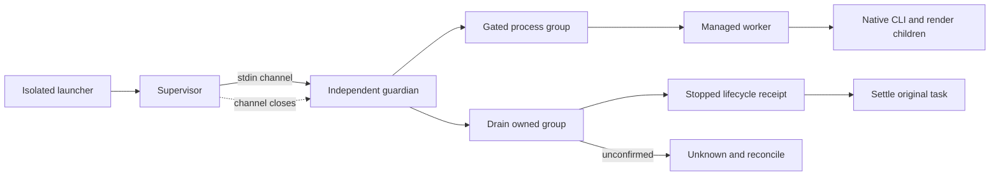

## 受管理分段恢复候选补证

当前 macOS arm64 候选已将 png-segmented 检查点接入公开 reconcile/resume：同一任务、原工程、运行时、执行资源和输入摘要匹配，且自有进程树已确认停止后，只继续导出步骤，不重发编辑。恢复保留原截止时间、操作ID和历史生命周期回执；再次 resume 已交付任务返回原结果。取消请求、变更工程/运行时、损坏上下文、未知编辑和无停止证据均拒绝续写。

[当前候选证据](evidence/managed-segment-resume-validation-20261008.json)记录212项默认回归（176通过、36条件跳过），实际异常及SIGKILL中断驱动后的恢复各一例：12帧与连续渲染逐帧一致，已完成段字节/inode/mtime、原工程和已完成编辑回执保全。SIGKILL发生在分段之间的验收驱动，不代表原生CLI正在渲染时被杀的验收。素材坏摘要前置失败测试及原生移动/替换回归也通过。旧证据只证明原快照，不证明当前改动。

跨重启守护器接管、GUI外部冲突、完整资源计量、Web受管理编辑、其他目标系统/架构、最终宿主及固定发布继续开放；9.3与完整V1不关闭。

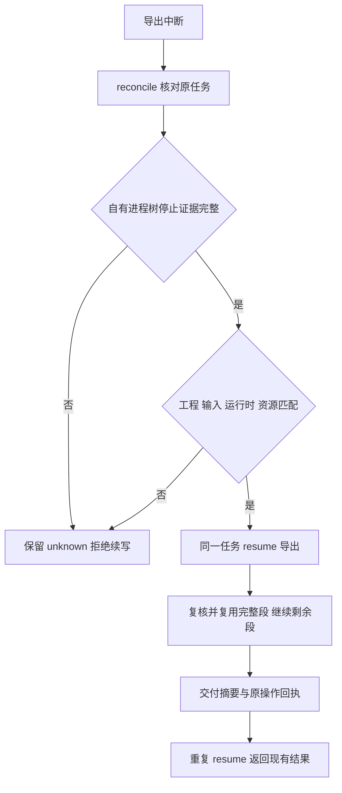

## 祖先任务停止约束候选补证

[组件证据](evidence/managed-ancestor-stop-component-20261008.json)绑定当前源码：副作用调度和新子任务创建前重读完整祖先链，持久取消意图即使进入reconciling仍有效，祖先期限缩短或父链循环均拒绝调度。监督器在自有调用运行期间同样核对祖先约束，先落盘取消再关闭守护通道；未知编辑保持attempted和原身份，不以进程停止当作未执行证明。

三个账本失败用例及一个真实进程失败用例已转绿。默认216项测试180通过、36条件跳过；17项账本测试、启用原生后的6项监督器测试、当前候选的1项原生分段恢复通过，15技能资源一致。原生创建/重开/12帧视频完整解码证据单独绑定技能摘要。此前分段强杀证据属于此前快照，当前变更后重新验证的是异常中断恢复，不冒称已重跑全部故障矩阵。

完整帧数/字节/CPU/内存计量、review/revise父链损坏矩阵、守护器崩溃接管、其他平台、GUI外部冲突、最终宿主和固定发布仍开放，9.3及V1不关闭。

## 共享渲染资源候选补证

受管理workflow在预览/导出前将帧数与解码字节预占到内部 `effectcraft-resource-budget/v1` 根任务账本。父子共享10000帧、64GiB解码量与2GiB编码媒体上限，单次序列原有更严格限制保留。恢复复用相同任务/资源绑定，不重复预占；失败尝试不自动归还。导出阶段观察到的媒体字节以高水位持久化，超限事实先保存再拒绝成功，删文件或重启不能降低已用量。缺少账本的历史任务仅诊断，损坏/悬空预占拒绝续写；跨记录检查和更新共用存储锁。review/revise根任务查询复用带循环检测的父链方法。

[当前组件证据](evidence/managed-resource-component-20261008.json)：9项账本测试覆盖并发子任务、重复预占、越界高水位、旧账本缺失及删除子预占；226项默认回归189通过、37条件跳过。真实原生初次创作与子任务改字导出合计30帧，媒体字节与实际文件一致、原工程保全；单技能原生创建/重开/12帧视频完整解码及分段恢复（12帧连续渲染像素对照）通过，三份证据的技能摘要均匹配当前候选。15技能资源同步一致。

预览在导出上下文形成前中断的占用核对、原生渲染中强杀的临时数据计量、命令计划/桌面计量、CPU/内存、其他平台及最终宿主与固定分发仍开放；此项不关闭9.3或整个V1。此前组件证据只适用于各自快照，当前验证范围以本证据的排除项为准。

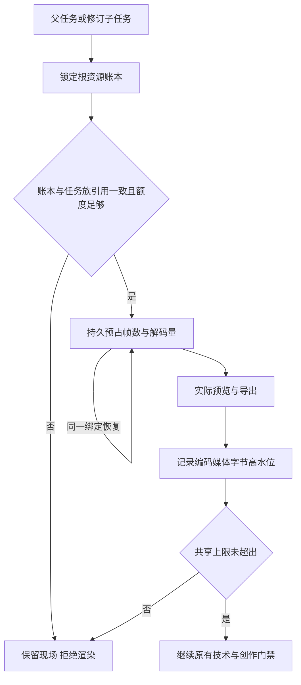

## 崩溃后自有媒体占用候选补证

workflow在首次预览及分段原生调用前登记内部 `effectcraft-resource-locations/v1`：目录路径、设备/inode身份、有限发布别名和媒体种类。监督器实时采样已登记的媒体，进程树确认停止后严格核对；公开reconcile也按原位置计量。主输出与已发布段重复命中同一文件只计一次。目录被替换、活动目录失踪、媒体链接或损坏记录形成UNKNOWN，保留原现场并阻止任务族继续写入。运行中因文件改名导致的短暂FileNotFound等待下一次采样，停止后不得忽略。计量诊断不替代未知编辑的回执。

[当前组件证据](evidence/managed-resource-location-component-20261008.json)：8项位置/故障测试，235项默认回归197通过、38条件跳过。实际原生预览写出后在编辑回执落盘前强杀worker；守护器确认进程树停止，公开reconcile计入原暂存PNG字节，原工程与操作身份保全，resume保持reconciling且不重放。当前单技能原生创建/重开/12帧完整解码及分段恢复再次通过；三份原生证据的技能摘要均匹配当前候选，15技能资源一致。首次验收夹具错误关闭控制管道，修正后重跑；未把夹具错误列为产品红灯。

仍未覆盖原生正在写半帧时强杀、孤儿分段暂存的归档及自动恢复、守护器自身崩溃接管、commands/desktop计量、CPU/内存、其他平台/宿主和固定发布；9.3及V1继续开放。历史证据只证明各自旧快照。

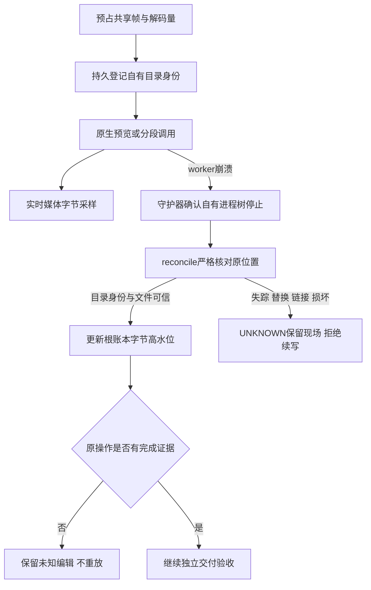

## 孤儿分段归档与再次调用预算候选

独立技能源已实现内部版本化归档日志：显式resume核对原任务、进程树停止证据、工程/运行时/检查点后，以同文件系统目录移动保全已登记的未发布段；归档在成功交付之外，仍计入共享媒体字节。reconcile只确认原移动，不主动归档或重发编辑。未知文件、链接、身份冲突、目标异常及移动失败保留现场并拒绝续写。

根账本兼容扩展segmentAttempts：首次调用使用原计划预占，同段再次调用在启动前追加独立尝试及额外帧数/解码量，完整段复用与同一尝试核对不重复计量。失败和超预算事实跨重启保留，超预算不得启动原生调用。

[当前组件证据](evidence/managed-orphan-retry-component-20261008.json)：9项归档与7项预算/组合测试通过；真实原生写出4帧后、发布前强杀worker，经公开resume保全归档摘要/inode/mtime、原编辑回执及已完成首段，12帧连续渲染像素对照通过，第二段两次尝试已计量。普通原生创建/重开及12帧视频完整解码再次通过。仅关闭9.13和9.14的组件范围；未把候选同步为固定技能快照。

原生CLI写入中强杀、守护器自身强杀接管、commands/desktop与CPU/内存计量、其他平台/宿主及固定发行仍开放。9.3和整个V1保持未完成；旧报告仅适用于各自快照。

## 固定开发版发行复验

插件dev.39锁定技能源dev.37。[当前固定证据](evidence/effectcraft39-fixed-managed-release-20261008.json)核对全部15技能与公开ZIP逐文件一致；单项目技能在系统PATH和空Python/原生缓存中自动安装Python3.13.16，完成原生创建/保存重开和12帧视频完整解码。公开包孤儿段恢复的12帧连续渲染像素对照通过。源码254项中216通过、38条件跳过；GitHub macOS/Windows/Linux合同和原生CLI发现作业通过。旧候选证据保留各自快照边界；其他架构、完整目标平台创作、最终宿主及完整V1仍开放。

## 序列质量复检候选

当前技能源候选重算普通与分段序列的逐帧描述，包括编号、字节/像素摘要、alpha和有理数时间基准；分段额外核对原工程、合成、区间及每段回执。刷新整个包的文件摘要不能掩盖描述与实际内容不一致。未知或不完整描述记录技术FAIL。此增量尚未替换dev.39固定快照，完整9.4、跨平台及宿主门禁保持开放。

## 版本评价与最佳结果候选

新增任务族评价账本：固定首次标准，同版本复用请求、相同回执幂等、冲突回执拒绝；根记录原子结算停滞和最佳版本，保留不可覆盖的请求/响应/报告及产物摘要。旧评分无账本时只诊断，不重置预算。14项目标测试、273项回归（235通过/38条件跳过）及真实原生局部修订通过；实际观察标题裁切后只改标题，最终工程/技术/创作通过，用户接受false。证据 [review-ledger-candidate-20261008.json](evidence/review-ledger-candidate-20261008.json)。本轮仅源码候选，dev.39固定插件未变；完整Judge范围合同、宿主/平台与V1仍开放。

## Judge v2与实际宿主观察候选

请求/回执采用显式v2，绑定任务、工程/媒体、标准和范围摘要；范围包含有理数时间基准、半开帧区间和实际请求的样本。观察回执绑定媒体字节摘要、实际查看的帧索引及方法。缺视觉/时序能力或样本覆盖保留NOT_RUN回执，不选最佳、不消耗停滞；旧v1仅诊断读取。技术未验证时不生成不完整请求，同任务可在解码器可用后继续review。

当前Codex实际查看前后各5帧视频及透明预览，经公开入口仅改标题修复裁切，重开/解码/非目标保全、最佳版本和重复回执验证通过；10项合同、23项账本/修订及292项回归（254通过/38条件跳过）通过。闭合9.18、9.4.3、9.4.4限定门禁，完整9.4.2仍待核验过期回执当前状态的CLI输出，9.4.1/9.4与V1保持开放。抽样PASS不代表全帧验收，用户接受false；无新增独立付费模型依赖。当前源与实际验收副本逐文件一致，固定插件仍为dev.39。见[当前候选证据](evidence/judge-v2-candidate-20261008.json)。

9.4.2公开CLI拒绝状态补证通过；298项回归260通过/38条件跳过，真实已评价工程变化后返回技术FAIL、创作NOT_RUN并保全历史和任务。 [Evidence](evidence/review-rejection-candidate-20261008.json).

9.19视频/素材技术组件通过：9项真实媒体与5项素材测试，312项回归274通过/38条件跳过；当前单技能原生及公开review正反例通过。9.4.1及固定发行保持开放，插件dev.40快照不修改。 [Evidence](evidence/video-assets-review-candidate-20261008.json).

当前workflow工程检查已使用任务绑定的已安装运行时，临时复制工程及声明素材，实际重开/缺失素材检查/原生结构比较，并前后核对原件摘要。缺运行时或超时NOT_RUN；原生错误/结构变化FAIL；旧PASS回执只保留历史证据，不提升本次创作。revise在扣轮数前执行相同核验；userAcceptance独立NOT_RUN，accepted布尔兼容。325项回归287通过/38条件跳过，当前单技能原生及视觉1轮修订闭环通过。commands/desktop归一化复检、9.4.1、固定分发与其他目标平台继续开放。 [Evidence](evidence/engineering-review-candidate-20261008.json).

## 开发版 dev.41 发布范围

本版固定技能源 dev.39（3552034d420df3028228df60abd07718983f7965），通过来源标签、提交及15项整技能摘要获取快照。包含9.19视频／素材技术校验与9.20当前工程隔离重开；325项源码回归中287通过、38条件跳过。原生与视觉证据的有效范围以 engineering-review-candidate-20261008.json 所绑定字节为准。历史候选中的“固定发行未更新”描述保留当时状态，本节记录本次分发更新；不追加未执行的宿主或冷安装验收。

完整V1与75项任务仍开放，尤其commands/desktop等价质量复检、其他目标平台与最终宿主派发；marketplaceEligible保持false，不归档OpenSpec变更。

## 命令与桌面质量观察候选

9.21限定组件通过：受管理命令及自有桌面共用调用前原生快照、修订号和渲染前后实际素材摘要，内部记录保存在任务状态目录，公开命令计划／回执和用户文件保持兼容。每个当前保存工程核对全部合成与图层，素材在隔离副本重映射后通过原生检查；PNG使用自身渲染版本的尺寸／alpha合同。未保存的渲染版本不归给后来工程，未覆盖输出明确NOT_RUN。

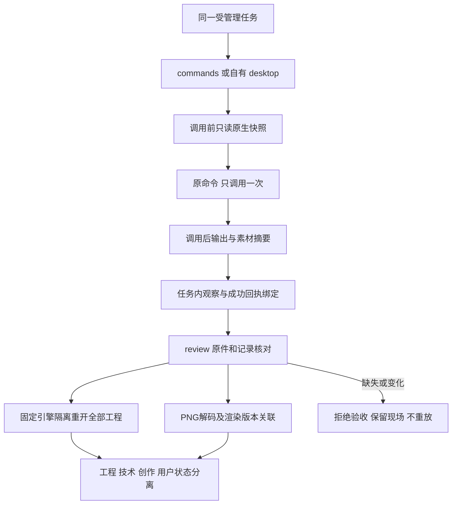

28项目标及353项回归（315通过／38条件跳过）通过。当前独立技能经公开launch分别完成命令与桌面两工程／两PNG／素材用例，14个公开review反例保全现场并在恢复原件后再次通过。桌面监听归属和进程退出已核实；仅复用准备好的缓存，不声明冷安装或模型派发。命令视频／序列、Judge及自动修订、9.3.6、9.4.1与完整V1继续开放；创作／用户接受保持NOT_RUN。本次分发为技能源dev.40／插件dev.42；固定宿主安装派发尚未验收。[候选证据](evidence/command-delivery-candidate-20261008.json)。

## 开发版 dev.42 发布范围

通过维护中的快照导入器固定技能源dev.40（`ef2b4d41e1e8588bfe732717713e8be861e04e55`），核对15项整技能摘要。限定任务9.21具备当前原生及公开拒绝路径证据；75项任务仍开放。源码315通过/38条件跳过。新固定分发尚无模型派发验收，marketplaceEligible保持false，OpenSpec变更保持活动。

## 命令与桌面Judge候选

受管理commands/desktop复用既有Judge v2及不可覆盖任务族账本，内部观察适配保持公开命令计划/回执和用户输出兼容。`scope.contexts`分别绑定合成、原生修订、素材身份、时间基准与所需帧；每个媒体声明context，必须分别覆盖各作品样本并实际观察全部请求媒体，不混合帧覆盖。缺能力/覆盖保留NOT_RUN而不结算评分，重复回执幂等、冲突或过期拒绝；历史PASS不能覆盖当前工程/技术失败，用户接受独立。

10项目标和363项回归（325通过/38条件跳过）通过。当前单技能公开命令及自有桌面原生创建/保存/重开两个运动合成，Codex实际查看8张绑定PNG并比较各合成的两个时刻，随后公开导入评价；两模式各7项拒绝/幂等/当前门禁验证通过，原件/评分保全。只证明具体样本，不声明全帧或插值质量。限定9.22完成；局部revise、视频/序列、固定宿主派发和完整V1保持开放。已发布source40/plugin42快照不变。[证据](evidence/command-judge-candidate-20261008.json)。

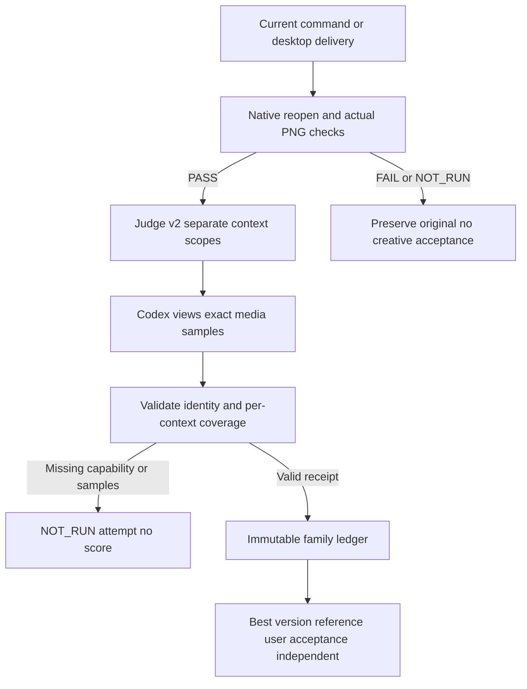

本次分发：技能源dev.41／插件dev.43包含任务9.22。任务9.23仅为规格及本地在制工作，未完成修订代码排除在不可变技能源快照之外；完整V1及新固定宿主验收仍开放。

## 命令局部修订开发增量（dev.42 / plugin dev.44）

原任务预先绑定工程、合成、图层与静态属性范围；修订前复核当前评价、原生门禁、版本和共享预算。私有工程种子保留全部原生字段，素材按实际摘要重定位，目标文字仅允许更改文本而保留字体样式。子版本真实重渲染并核对非目标字段、关键帧和未影响合成的实际像素。

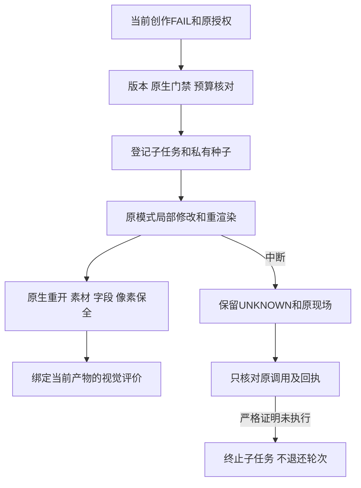

40项目标测试及403项回归（365通过／38条件跳过）；原生命令多合成四样本、带真实导入素材的一样本完成裁切问题修订和复检。桌面第二轮因驱动器500秒超时停止，核对缺少失败回执，保留未知现场，不重发编辑。完整9.23、初始命令资源计量、跨文件结算崩溃矩阵、固定宿主派发与其他平台继续开放。公开协议所有权与旧调用保持兼容。见[当前证据](evidence/command-revision-candidate-20261008.json)。

## 当前桌面修订及结算恢复候选

当前源码新增三个失败用例（2失败／1错误），修复缺回执的明确unknown诊断，以及子任务已终止、根占用未解除的跨文件结算中断。公开reconcile重新核对原证明／调用／种子／停止证据，证明改变则保留占用，不退款、不重放。新增预算防护测试覆盖取消、期限及篡改停滞计数；46项目标测试及409项完整回归（371通过／38条件跳过）通过。

独立桌面标题＋导入素材场景经公开launch完成原生创建、实际裁切观察、一次文字局部修订、保存重开、素材重定位摘要保全及当前视觉PASS。Codex实际查看前后绑定PNG，只评价一个样本，用户接受NOT_RUN。七项实际桌面公开入口拒绝覆盖过期绑定、授权范围、扩大参数、缺运行时、两轮、取消和截止期限；测试故障注入仅作用于自有QA状态并逐项恢复原字节，原件／预算不变。先前超时未知任务原样保留。

初始commands/desktop渲染尚未完整计入任务族资源，过期／取消后结算恢复矩阵、视频／序列、固定宿主派发及其他平台仍开放；9.23暂不勾选。插件运行快照仍是已发布dev.44／source42，本增量未提交或发布。[当前证据](evidence/command-revision-recovery-candidate-20261008.json)。

## 命令／桌面局部修订与共享PNG资源门禁完成（候选9.23）

受管理根计划在原生执行前预占声明PNG帧数，每次渲染在调用前以操作摘要登记原生尺寸解码量；预占与实际尝试取覆盖上界，子版本不重复收费，失败不释放已用量。自有目录身份、显式媒体路径和PNG高水位参与崩溃核对；输入素材／桌面私有缓存不计为输出媒体。路径异常、媒体链接或目录替换保持UNKNOWN。旧任务缺少根帧计量时仅可检查，不补造预算或自动修订。

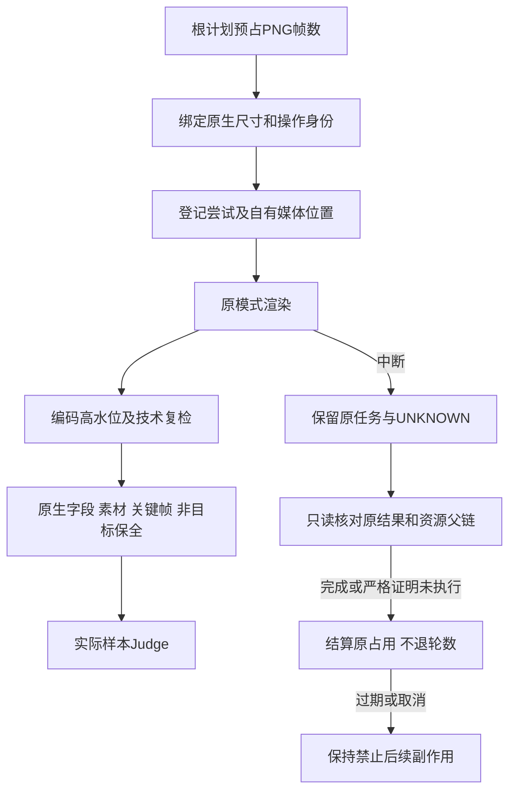

13项资源、50项修订／恢复及426项完整回归（388通过／38条件跳过）通过。commands和自有desktop各从独立技能公开launch完成真实裁切问题→一次文字修订→原生重开／素材与关键帧保全→当前样本创作PASS。每模式实测父子共4帧／245760字节解码量，编码高水位等于父子实际PNG总大小；原始输出不变。Codex实际查看前后各两个时刻，徽标指定区域像素逐字节相同；涉及半透明素材与修改文字重叠的像素不声明完全相同。用户接受NOT_RUN；不代表全帧／插值或逐属性原生验收。

每模式8项公开拒绝验证通过：绑定、范围、参数、缺运行时、资源、两轮、取消及期限；自有QA故障注入逐项恢复原字节。新增过期／取消只读结算测试通过；对先前过期桌面部分编辑的当前公开reconcile明确返回UNKNOWN，保留原输出、两轮预算与占用，不重放。最后的损坏路径诊断修复仅改变resource_meter.validate，使用当前源码副本再次原生／技术复检既有交付通过；历史执行副本保留，证据记录差异。

仅关闭9.23命名的本机静态PNG修订组件；9.3、9.3.6完整资源模式、CPU／内存、视频／序列、动画目标时间范围、逐命令／GUI、固定宿主派发、其他目标平台和V1继续开放。已发布plugin44/source42不变，本增量尚未提交发布。[当前证据](evidence/command-revision-resource-candidate-20261008.json)。

## 命令目录升级差异候选（2026-10-08）

技能源新增离线 `commands.py diff BASELINE.json`；每个独立技能都携带本地实现及固定目录，不读取兄弟技能，不触发下载、安装、任务登记或原生编辑。目录保存655条参数合同／归属／模式路由，以及22个原生工具inputSchema。运行模式字段描述网关路由，实际enabled仍须执行前查询，所有模式验收保持NOT_RUN。

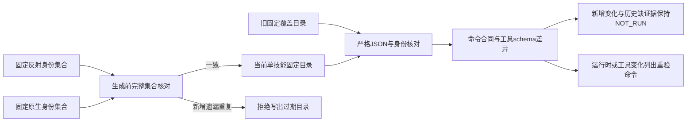

原生只读查询核对锁定EffectCraft0.4.0的655条命令及22个工具schema。对旧source43覆盖目录比较时，655项变化均是本候选新增的模式合同字段，不表示原生新增655种能力；旧目录缺少工具schema，差异输出明确NOT_RUN。15个技能各以单独副本在含空格只读路径通过公开入口，使用隔离Python3.13.16、运行时目录不存在，全部技能文件摘要保持不变。

15项目标测试先红后绿；完整441项回归403通过、38条件跳过。完成组件任务9.24；9.2／9.2.1完整doctor和Web／FreeBSD、逐命令创作、其他平台及固定宿主验收仍开放。新增实现仅在技能源工作区，插件skills/继续保持已发布source43快照，未提交／发布本候选，未改变市场资格。证据：[命令差异候选](evidence/command-catalog-diff-candidate-20261008.json)。

## Doctor实际能力诊断候选（2026-10-08）

任务9.2.1的只读诊断与命令目录合同现已验证完成。默认doctor报告平台、锁定／实际Python版本、已安装CLI完整性、655命令目录及可执行恢复argv；它不启动原生进程、不执行恢复。显式`doctor --probe-native`在完整性与最低系统检查通过后，以限时自有空headless会话只查询版本、tools/list及list_commands；坏旧目录优先拒绝，缓存损坏、缺失或条件不满足时不启动CLI。超时不重试，未知任务不恢复。

15个独立技能副本在含空格只读目录实际探测到CLI0.4.0、655命令／22工具schema；15次无Python启动均只读返回缺失。公开Shell入口复验通过，CLI载荷、未知任务记录及技能文件摘要保持不变，原生二进制打开句柄恢复原状。17项目标测试通过；458项完整回归420通过／38条件跳过。结合9.24差异组件关闭9.2.1，当前74项实施任务仍开放。

探测PASS仅证明版本／注册身份／工具schema符合固定合同；创作、desktop、目标平台整体和宿主验收独立保持NOT_RUN。Web／FreeBSD、其他平台原生创作及固定宿主自然语言派发仍开放；插件skills/保持已发布source43快照，候选未提交／发布。前一目录组件章节中doctor开放状态属于该阶段，当前以本节和tasks为准。[证据](evidence/doctor-capabilities-candidate-20261008.json)。

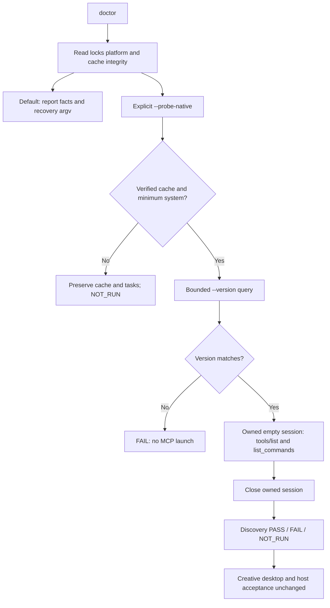

冷启动恢复补充 / Cold recovery completion: Shell及PowerShell在无Python时也报告准备隔离Python的实际入口argv，不自动执行；POSIX引号路径实测通过。PowerShell显式UTF-8避免恢复路径中文损坏，语法与实际JSON返回分支在本地PowerShell引擎通过；真实Windows主机验收仍NOT_RUN。最终证据绑定两种启动脚本及最终源码；早期456项回归是中间记录，当前有效回归为458项、420通过／38条件跳过。

## 开发分发 dev.47／技能源 dev.44

本次分发纳入已完成的 doctor 与命令目录差异增量（9.2.1、9.24），此前候选描述保留其阶段范围。未完成运行时绑定草稿不纳入本版。不可变快照独立校验；发布不关闭剩余 74 项任务、原生平台和固定宿主自然语言验收。

## 任务执行绑定候选 — 2026-10-09

9.25关闭任务私有执行快照及原控制器恢复组件：24项目标及482项回归（444通过／38条件跳过）、15个独立入口登记通过。macOS公开resume/review在测试源锁改为不可用假设新版本后仍使用原隔离Python3.13.16、控制器和EffectCraft0.4.0，身份、期限及快照不变；新任务采用不同代码快照。两份工程及两份12帧视频通过原生重开/完整解码；三项公开快照缺失/清单损坏/执行文件变化反例保全状态与worker日志。

Windows Job/EOF控制器适配仅有组件合同测试，不算目标平台原生通过。两个真实原生版本升级、全局清理、其他原生平台和固定宿主派发仍开放；9.1.4与EC-RT-002未完成。插件skills/仍为已发布source45不可变快照，候选未提交发布。[证据](evidence/task-execution-binding-candidate-20261009.json)。

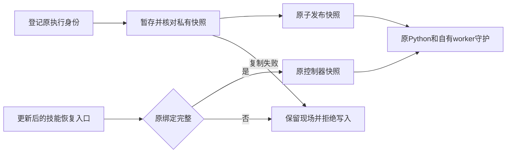

## 2026-10-09 开发发行状态 / Development release status

技能源 dev.47／插件 dev.49 纳入任务执行绑定组件9.25；此前章节的“候选未发布”和旧锁定版本仅描述各自检查点。24项绑定测试与macOS原生恢复证据对应本次执行代码，固定安装后的智能体自然语言派发验收仍开放。两个实际原生版本升级、跨状态根清理、其他目标平台及完整V1不因本次发布关闭。

Source dev.47 / plugin dev.49 includes component9.25. Earlier unpublished-candidate statements describe their historical checkpoints. Publication does not qualify installed-host dispatch, two actual native-version upgrades, global cleanup or full V1.

## 2026-10-09 真实双版本升级与安装回执 / Actual two-version upgrade and installation receipts

安装复用现在核验无歧义UTF-8回执及名称、版本、平台、官方来源、URL、归档／二进制摘要、实际版本输出与载荷锁。doctor、原生工程重开、命令交付及修订核对都传入固定版本／平台；坏回执保留现场，不下载、覆盖或改用其他版本。4项升级组件测试先出现13个目标失败断言，再转绿；7类安装失败保全旧版。完整回归486项：448通过、38条件跳过。

本机官方0.3.1（654命令／21工具的真实只读反射）与0.4.0隔离验收：旧任务的comp.new已成功登记，旧CLI仍持有可执行文件时安装新版；更新单技能文件后旧运行任务继续完成，另一个已登记未执行的旧任务通过公开resume/review完成。新任务绑定0.4.0及隔离Python3.13.16。四份原生工程独立重开与12帧视频完整解码通过，原身份／期限／快照与旧安装摘要保全，生命周期均stopped。坏新版归档另验证旧任务仍能公开恢复和交付。QA仅在旧控制器副本加入“首个图层编辑登记前暂停”门，不改变参数、回执或生产代码；首次验收脚本字段名错误保留，原生任务已正常结束，未重放未知结果。

Receipt reuse now checks unambiguous UTF-8 JSON and the pinned installation identity. Readonly doctor and native engineering/delivery/revision verification pass the pinned version and platform. Invalid receipts remain untouched. Actual macOS old0.3.1 tasks retain their frozen execution and runtime during new0.4.0 installation; old-task public recovery and new-task isolated-Python execution deliver reopened native projects and fully decoded media. Seven portable failure classes are distinguished from the actual bad-archive case.

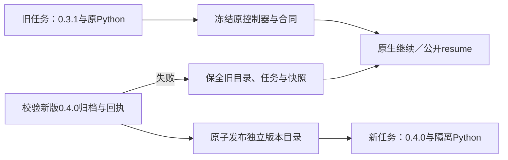

此组件不关闭9.1.4、2.4–2.6、其他目标平台或完整V1：跨状态根清理尚缺实现与证据；旧Python3.13.5仅绑定外部执行文件，不证明旧隔离标准库升级。新候选未提交／发布，插件skills/仍为不可变source47快照；安装后智能体自然语言派发尚未验收。首次暂停是受控测试边界，不等于未知编辑的可恢复证明。[证据 / Evidence](evidence/runtime-upgrade-component-candidate-20261009.json)。

## 2026-10-09 前一检查点：隔离Python双版本与入口失败 / Previous isolated-Python checkpoint

启动前新增Python安装回执校验：非链接文件、固定版本／平台／归档摘要、无额外／重复字段与非法编码；兼容旧入口生成的六种字段顺序和排版。坏回执保留，不调用解释器、不重装。4项POSIX公开入口测试先出现13个失败断言后转绿；PowerShell实际函数在本机19例通过，语法通过，真实Windows执行仍NOT_RUN。3个实际隔离Python坏回执公开doctor反例均保全回执和全部任务文件。

官方install_only制品3.13.15（20260929）和3.13.16（20261003）在同一私有Python根中依次准备。旧task的comp.new已成功、旧CLI和Python仍运行时，原子安装新Python与CLI；旧任务继续或从新技能公开resume/review后仍使用原3.13.15完整载荷与0.3.1，新任务使用3.13.16／0.4.0。两旧一新三份工程重开、12帧视频完整解码通过；原任务身份／期限／快照、旧Python整个发行与旧CLI目录保持。隔离标准库证据来自真实载荷清单及运行时核对，不再以外部Python执行文件代替。

Current launchers reject invalid Python receipts before invoking an interpreter and preserve existing files. Actual isolated3.13.15 and3.13.16 native tasks verify full distribution retention while upgrading official CLI0.3.1→0.4.0. Regression490 total:452 passes/38 conditional skips. PowerShell on macOS proves function contracts only, not nativeWindows qualification.

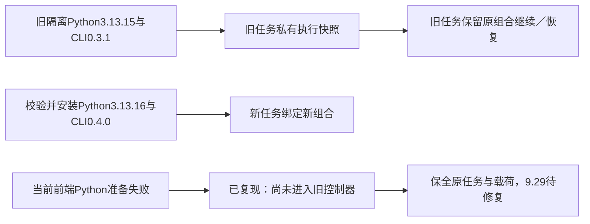

新发现的真实失败必须保留：调用已有old-held的公开resume，指定空的当前Python缓存并提供坏新制品；虽然绑定的旧3.13.15及快照完好，启动器仍先准备当前3.13.16并失败，无法进入原控制器。所有任务文件未改变、未重放编辑。这是9.29／9.1.4的未完成行为，不能用正常升级通过或本轮单元测试掩盖。后续须在当前Python安装之前选择并验证已有任务原执行资源；旧记录没有可信启动证据时保留现场，不能通过当前代码重建旧快照。跨状态根清理、其他原生平台和固定宿主仍开放。[证据 / Evidence](evidence/isolated-python-upgrade-candidate-20261009.json)。

## 2026-10-09 安装前任务派发候选 / Bound task entry candidate

v2执行绑定把固定字段启动描述摘要纳入任务身份。冻结目录原子发布原身份JSON、描述和完整技能快照；POSIX／PowerShell入口在任何当前Python安装或锁读取之前核对顶层原身份、原平台／系统下限、Python回执和完整载荷。只执行当前包内的只读Python校验器，重读原任务与完整快照后交接原控制器及runtimeHome；不执行任务目录里的Shell代码。POSIX采用同PID exec，Windows继续使用原自有Job与stdin所有权通道。当前v1绑定读取及原核验保留；缺少新启动材料的历史记录不隐式迁移、补建或重做。

macOS原生证据：隔离Python3.13.15／EffectCraft0.3.1的v2任务在当前Python缓存为空、坏新归档和坏当前Python锁下恢复；工程重开和12帧媒体完整解码PASS。原身份／截止时间／已完成步骤／冻结快照保全，错误前端runtimeHome被原绑定替代；坏原Python回执在启动解释器前拒绝。最终前端再次只读重开／解码通过，原任务快照仍为此前检查点，不覆盖历史字节。

Windows入口代码与语法、实际PowerShell身份函数8例和回执函数19例在本机验证；不能替代Windows原生入口／进程退出验收。9.29.1仅勾选macOS组件，9.29、9.1.4、跨状态根保留清理、其他目标环境、固定宿主自然语言派发和完整V1仍开放。候选未发布，插件仍固定source48快照。[证据 / Evidence](evidence/task-bound-entry-candidate-20261009.json)。

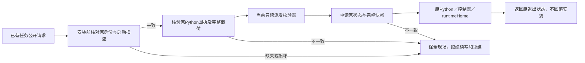

## 禁止进程枚举的沙箱与空组核对

未发布候选以本任务生命周期租约和原自有进程组为边界：信号0仅核对存在性，明确不存在时保存真实退出码；组存在或内核返回EPERM时仍查询成员。有效枚举可区分活动成员与僵尸；权限及枚举都无法取得有效证据时继续unknown。当前macOS真实沙箱及后代清理通过，旧unknown任务93文件保全且reconcile仍拒绝。10项目标／516项回归（478通过、38条件跳过）通过；Windows／其他POSIX原生目标、固定宿主及完整V1仍开放。[组件证据](evidence/process-group-probe-candidate-20261009.json)。

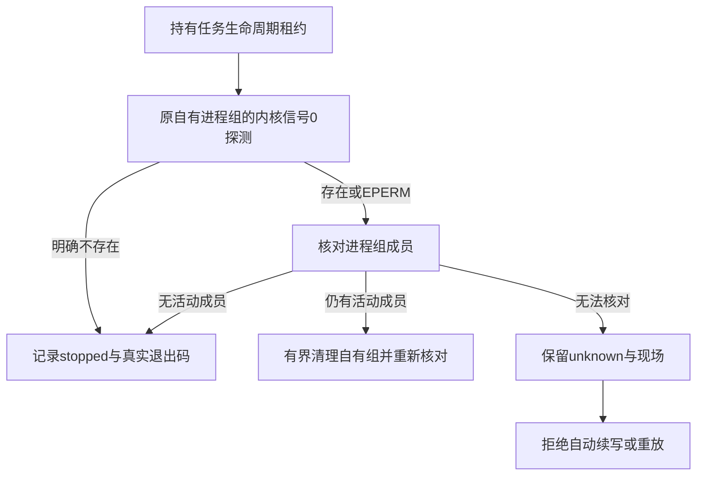

## 15个单技能只读离线验收

任务9.5.1在macOS arm64完成：15个只含一个技能的安装目录，全部包含空格且只读；操作系统禁止联网、读取开发工作区和执行系统Python，公开run/review均通过，原生工程重开及每例320×180／12fps／1秒的12帧视频实际解码通过。安装文件内容及只读模式不变，最终15份内容均匹配当前技能源，所有任务生命周期均stopped且未残留CLI进程。

首次从空Python和原生缓存消费已备官方归档，后续14例复用同一用户运行时缓存；不是15次冷安装。ffmpeg／ffprobe已预备，未验证自动安装这两项媒体工具。创作评价及用户接受仍NOT_RUN；领域代表任务／FilmCraft透明交接9.5.2、其他平台资格9.1.2、固定宿主及V1保持开放。当前候选尚未发布，也未运行候选CI。[证据](evidence/independent-offline15-candidate-20261009.json)。

## POSIX 进程组归属发布 dev.51／plugin dev.53

开发版技能源 dev.51／插件 dev.53：POSIX 私有进程组归属及 nonce 绑定业务结果覆盖守护器丢失、孤儿后代和强制取消。当前回归及离线安装副本证据见 [发布验证](evidence/group-ownership-release51-20261009.json)。下方历史检查点保留原摘要；跨平台原生、固定宿主、创作验收及完整 V1 仍开放。

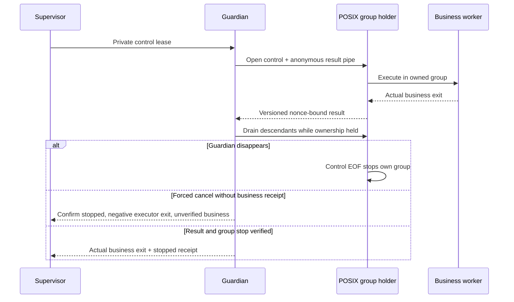

## 控制器重启后的取消结算

未发布的取消恢复候选（基于source51／plugin53）：启动租约仍占用时保留cancel_requested；重启后核对原停止回执，保留未知编辑。版本化退出记录区分强制组停止与已核对业务退出。12项目标、536项回归（498通过／38条件跳过）及当前只读独立技能真实原生取消／监督器中断／重启核对通过。已发布快照不变；完整父子取消终态、其他平台、宿主及V1仍开放。 [证据](evidence/cancel-restart-candidate-20261009.json)。

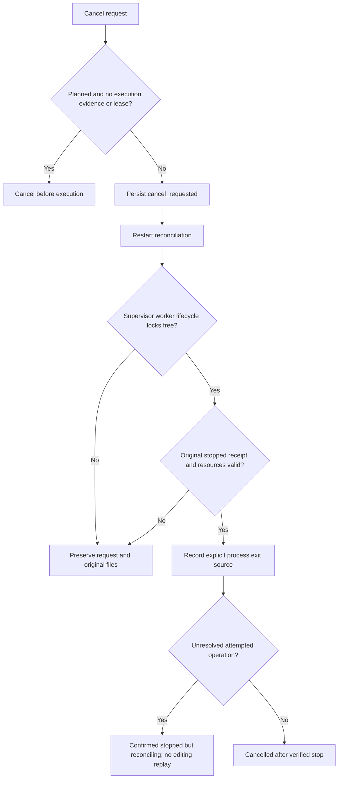

父子取消终态屏障（开发版source52／plugin54）：根取消意图与后代身份先落盘，后代仍活跃／缺少停止证明时保持cancel_requested；各子任务经原控制器核对后，未知编辑传播为父任务reconciling。未启动证明只在原取消时取得全部执行租约后生成，重启不补造。27项取消测试及真实macOS原生父子中断恢复通过；完整崩溃／GUI矩阵、其他原生平台、固定宿主与V1仍开放。证据：`docs/evidence/cancel-family-candidate-20261009.json`。

## 源工程在运行期间变化

9.3.2当前候选在启动、逐操作意图登记和最终交付前核对源工程摘要。发生外部保存、丢失、不可读或链接替换时返回revision_conflict，未发出的编辑不登记为已尝试，既有回执、原身份及用户新版本保全。真实独立原生会话保存后的阻止编辑证据见[候选核验](evidence/source-revision-conflict-candidate-20261009.json)。内存GUI、完整会话竞争、跨状态根单写和其他平台仍未验收，任务保持开放；插件发布快照不变。

## 不同账本的工程占用

新任务在用户级共享目录认领源工程的规范路径与文件对象，阻止通过更换state-root、任务ID、输出或硬链接别名绕过同一工程占用。认领绑定原账本与任务身份；原任务缺失、损坏或unknown时保留现场，不能根据PID消失或等待超时让出。旧无材料任务不自动补建证明；GUI内存和旧运行时并行范围仍待验收。当前组件证据见[跨账本认领候选](evidence/shared-project-claims-candidate-20261009.json)。

文件代际修复候选：文件对象键加入创建时间，旧未知认领保全，无法取得可靠代际时拒绝。Linux以核对过的文件描述符读取statx，其他平台使用原生birth time。[证据](evidence/project-creation-generation-candidate-20261009.json)区分本地容器合同与锁定Python、原生创作、宿主验收。source57/plugin59已发布快照不变，9.3.2保持开放。

本地桌面版本候选：受管理自有会话持久化工程和编辑上下文，原子保护execute_command、batch、打开／保存与run_script；未映射工具发送前拒绝，已确认只读工具调用后再核对。[证据](evidence/desktop-native-revision-candidate-20261009.json)分别记录原生映射、桌面独立控制修改和已安装公开入口，不等同模型派发或物理GUI操作。已发布快照保持不变，完整9.3.2及V1仍开放。

桌面原子冲突核对候选：`docs/evidence/desktop-conflict-reconcile-candidate-20261009.json`。v2证明绑定任务、操作参数、会话基线及已停止的所属桌面；公开reconcile/resume可报告单个操作未执行，原attempted与成功回执保全。旧v1、非原子变化或缺停止证明保持unknown；任务未决时拒绝新任务绕过。本增量尚未发布，完整9.3.3／9.3.4及V1继续开放。

source59／plugin61开发发行新增版本化命令完成证明，在核对全部原结果、停止身份、原生工程副本和实际媒体后只补齐交付登记；取消或材料变化不发布迟到结果。完整崩溃、普通编辑恢复及V1仍开放。当前验证见[发行证据](evidence/release59-validation-20261009.json)。

本地真实进程故障候选（9.35）：命令和自有桌面分别验证完成证明写入前、写入后引用未保存、引用保存后三个SIGKILL窗口。无证明及悬空证明不自动接管；完整原证明仅在真实停止、只读重开和实际PNG解码后补齐交付，原文件／回执与预算保全。同时修复损坏ownership导致公开核对输出traceback的问题，保留非POSIX缺字段兼容。见[候选证据](evidence/command-completion-crash-candidate-20261009.json)。其他目标平台、完整9.3.3／9.3.4与V1保持开放。

本地父子原生取消验收（9.36）完成：命令与自有桌面分别覆盖正常取消、取消落盘后监督器强杀。原冻结公开入口重启核对，父项等待子项，保存响应未登记继续未知；原工程／媒体／成功回执、截止／修订预算、共享资源及无关进程保全。四个原生案例与27项取消合同通过，4项默认原生条件跳过。[证据](evidence/native-family-cancellation-candidate-20261009.json)保留夹具修正历史与明确边界：父项已登记未调度，非完整修订父工程；缓存复用，Python3.13.5，只有macOS arm64。生产代码未改，source60／plugin62固定快照不变；新测试／证据未提交发布。完整9.3.4及70项V1继续开放。

当前技术门禁9.4.1已验收：[证据](evidence/technical-gate-acceptance-20261009.json)。带真实收集素材的MP4、普通与分段透明序列从独立只读技能公开入口完成保存／重开、解码和恢复幂等核对；坏视频／缺素材／坏工程的真实交付副本分别被拒绝，高分回执不能覆盖技术失败。六个原生正反例通过；78项目标回归72通过／6条件跳过。工程、媒体技术、创作及用户接受分列，后两项保持NOT_RUN。macOS arm64、隔离Python3.13.16与已校验缓存复用，不替代其他平台、模型派发或逐命令全部输出验收。当前V1尚有69项开放；生产快照source60／plugin62不变，新验收未提交发布。

技能源dev.61／插件dev.63发布9.36与9.4.1验收增量；此前未发布候选陈述为各自历史检查点。当前69项V1任务开放，执行资源与source60字节一致。 / Source dev.61 and plugin dev.63 publish the9.36 and9.4.1 acceptance increments. Earlier candidate statements retain historical scope.69 V1 tasks remain open; execution resources are unchanged from source60.

本地血缘候选（EC-AR-001，5.1–5.3进行中）：工作流在兼容的manifest中生成ArtCraft持有的craft-artifact/v1，绑定逻辑身份、不可变整包版本、实际任务、源版本、原生工程、派生引用和已收集媒体依赖。review和移动源包修订重验完整文件表；同名内容替换、旧版本复用、引用错配及链接拒绝。源包完整绑定写入任务授权，登记后清单／依赖变化在下一次编辑和交付前阻止。独立CLI显式standalone，旧包引用只登记可验证的legacy工程内容。当前为未发布技能源候选，插件仍锁定已发布source61；命令／桌面公共产物映射、字体／LUT依赖发现、固定发行和完整协议原生验收尚未完成，5.1–5.3不提前勾选。

未发布来源生产任务保护候选：完整包复制／移动或换state-root后，受管理来源仍核对原任务、逐操作回执、持久交付摘要及所属进程停止证明。用户级定位记录只指向原账本，不能证明完成；新任务持久绑定来源，并在每次编辑意图／交付前重核对。10项定向测试、708项回归（643通过／65条件跳过）和真实worker完成包后、账本交付前SIGKILL案例通过；公开plan/run跨账本拒绝未知副本，原reconcile/resume不重放，已确认交付移动后的跨账本修订与原生重开／实际PNG检查通过。首轮原生夹具顺序错误留证。仅macOS arm64及缓存复用；完整9.3.3、旧包／命令／桌面矩阵、其他平台和宿主保持开放，当前69项未完成。插件继续锁定source62／plugin64。 证据 `docs/evidence/source-producer-guard-candidate-20261009.json`。

本次发行 source dev.63／plugin dev.65 包含来源生产任务保护及 commands／自有桌面的公共产物映射：多工程分别登记真实任务、不可变包版本、原生工程、匹配PNG和媒体依赖；旧交付只读兼容。映射可随整包移动重验，不能替代技术、创作或用户验收。原候选报告保留观察时范围；当前发行证据见 [发行验证](evidence/release63-validation-20261009.json)。字体／LUT发现、完整故障矩阵、其他原生平台与固定宿主派发继续开放；5.1–5.3不勾选，V1仍有69项未完成，不归档。
