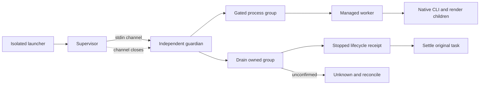
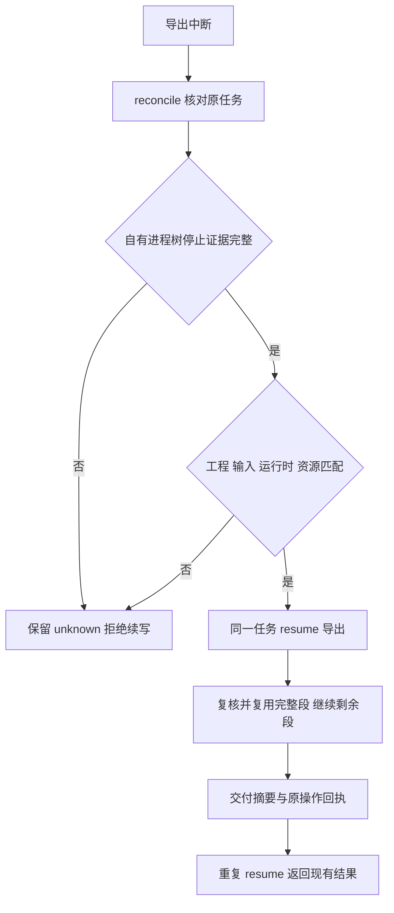
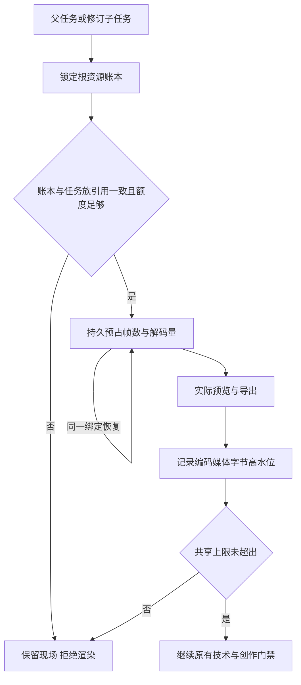
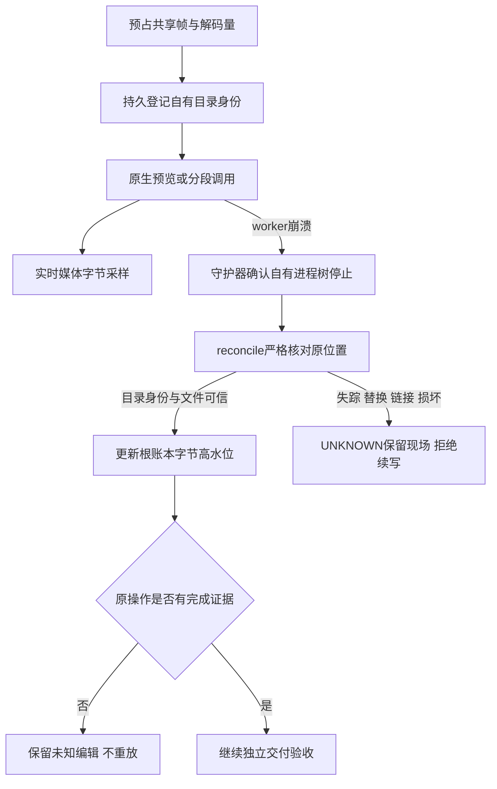

# EffectCraft 优化候选交付

发布更新：插件dev.39固定技能源dev.37（8babe4b187b2f8d6de6f494d1bf1437e794946c5）。下文候选与旧快照记录保留各自证据边界，不代表完整V1或全平台/宿主验收。

本插件消费 `skills.lock.json` 固定的dev.37技能源标签与提交，发布前校验原始来源和全部15技能摘要。下文旧候选证据保留各自快照边界，不证明完整跨平台或宿主验收。

候选执行代码在独立 effectcraft-skills 仓库。已实现隔离 Python/原生制品锁、七平台适配、持久化任务、产物评估与有限修订；原生 CLI 从 640 条目录更新到固定 0.4.0 的 655 条观察，每个新增命令默认 NOT_RUN。

参见 [候选实现与证据](evidence/managed-optimization-20261008.json)、[来源候选校验](evidence/managed-source-candidate-20261008.json)、[透明交接](evidence/managed-alpha-handoff-20261008.json)。原生场景、Codex 自然语言与一次受管理修订已在 macOS arm64 验证；宿主实际安装候选与后续校验增强的文件差异保留在证据，不混称同一快照。

分段恢复本机候选补证见下文。剩余代码项：跨重启进程接管、GUI 外部修改冲突、完整资源计量、Web 受管理编辑。剩余环境项：其他原生系统/架构、FreeBSD 构建、Web GPU 运行故障及更多宿主。全部 V1 与新增 9.1–9.6 综合门禁保持开放。

使用 `python3 scripts/verify_candidate.py --source /absolute/effectcraft-skills --report /tmp/candidate.json` 校验候选完整性。固定来源版本、插件快照、市场更新仍需单独发布授权，且不能替代真实验收。

## 启动前失败与首次使用补证

监督进程现在确认 worker 的真实退出码，并在同一持久任务中记录。worker 在 running 前退出且没有尝试任何步骤时，任务进入 failed，公开 CLI 返回失败；已尝试步骤而无法确认副作用时进入 reconciling。已交付、已取消的终态保持，worker 退出本身不证明原生后代进程已全部停止。

[候选组件证据](evidence/managed-supervisor-component-20261008.json)绑定本次具体技能文件摘要。真实源工程冲突失败例已修复，4项针对性测试通过；源码197项中163通过、34条件跳过。project技能独立复制后，在系统PATH和空Python／原生目录中安装Python3.13.16及EffectCraft0.4.0，完成20步创建、保存重开与视频导出。独立解码确认320×180、12fps、12帧；工程、文件清单和技能摘要保持。

OpenSpec 9.7仅为该候选组件完成；9.3综合合同、固定发行、最终宿主、全部15候选技能冷启动及创作审阅仍开放。本证据不改变已发布dev.34来源或插件快照。

逐技能补证：[15技能独立首用](evidence/managed-candidate-all15-first-use-20261008.json)。14项各自独立公开安装Python与原生CLI、核对版本及655条实时目录；project技能另有独立冷创建／重开／导出。全部15项与当前候选摘要一致、技能保全通过。此矩阵只覆盖macOS arm64源码候选，未关闭15项完整创作场景、最终宿主、固定发行或综合9.5；预览中的深色标题与黑底对比度偏低，保留创作审阅。

## 默认片头可读性修正

[当前候选补证](evidence/managed-readable-intro-20261008.json)：默认示例的标题由深蓝调整为浅色，解决黑底视频中对比度不足。新增真实视频解码断言先失败（标题区域亮像素为0），修正后通过；原生文字局部修改、徽标、透明首帧与不透明度关键帧保全同时通过。

修改后的project技能单独复制并从空Python／原生目录公开安装，完成20步创建、保存重开和视频导出。独立完整解码通过，320×180／12fps／12帧；标题区域540个像素超过检查阈值。实际预览已查看，完整创作及用户接受状态仍独立。

相对上一轮15技能矩阵，技能内容仅共享brand-intro.json发生变化，执行资源逐字节保持。用旧示例摘要替换当前清单中的该项，可重建每个旧完整技能摘要。上一轮原始冷启动目录现已不在工作区，汇总证据作为历史记录保留；本轮只重新执行一个修改后技能的真实冷创作，未声称15项全部重跑。固定发行、最终宿主与9.4／9.5综合任务仍开放。

捕获后的当前源码检查未通过：共享源新增process_guard.py，其他14项尚未同步。保留并行修改，本次可读性证据只证明已捕获复制快照，不能证明后续源码或整体候选可发布。

## 自有进程树守护候选补证

独立守护器已接入受管理执行：监督通道断开后继续排空自有进程组，写入生命周期回执，核对流程在生命周期锁占用或证据不完整时拒绝续写。macOS 的真实进程树与独立技能原生创建/重开/12 帧解码通过，当前技能摘要与证据一致。见 [组件证据](evidence/managed-process-guard-component-20261008.json)。Windows Job 通道、守护器被强杀后的接管、分段恢复及完整 9.3 仍未验收。

## 逐技能守护与冷首用集成补证

[集成证据](evidence/managed-process-guard-integration-20261008.json)补充9.8组件：15个技能分别单独复制到含空格目录，公开resume入口对源工程冲突均形成failed终态及stopped生命周期回执；旧复制快照在同一检查下因缺少进程树停止回执而失败。共享managed／process_guard／task_store资源在15项中一致。

当前默认源码回归202项中167通过、35条件跳过。新project副本在系统PATH和空Python／原生目录中完成公开安装与20步创建，工程重开、12帧视频完整解码、当前源码与副本身份及技能保全通过；生命周期回执为stopped、退出码0，独立进程组检查无执行成员。

首次尝试因临时磁盘空间不足而失败：完整测试22项错误、Python下载退出56。失败日志保留，确认进程终止且空间恢复后以新目录重试；未把环境失败列为成功。Windows及其他平台、守护器自身崩溃接管、分段恢复、最终宿主和固定发布仍开放。下图描述已验证的本地执行链；未知停止证据进入核对状态。

## 受管理分段恢复候选补证

当前 macOS arm64 候选已将 png-segmented 检查点接入公开 reconcile/resume：同一任务、原工程、运行时、执行资源和输入摘要匹配，且自有进程树已确认停止后，只继续导出步骤，不重发编辑。恢复保留原截止时间、操作ID和历史生命周期回执；再次 resume 已交付任务返回原结果。取消请求、变更工程/运行时、损坏上下文、未知编辑和无停止证据均拒绝续写。

[当前候选证据](evidence/managed-segment-resume-validation-20261008.json)记录212项默认回归（176通过、36条件跳过），实际异常及SIGKILL中断驱动后的恢复各一例：12帧与连续渲染逐帧一致，已完成段字节/inode/mtime、原工程和已完成编辑回执保全。SIGKILL发生在分段之间的验收驱动，不代表原生CLI正在渲染时被杀的验收。素材坏摘要前置失败测试及原生移动/替换回归也通过。旧证据只证明原快照，不证明当前改动。

跨重启守护器接管、GUI外部冲突、完整资源计量、Web受管理编辑、其他目标系统/架构、最终宿主及固定发布继续开放；9.3与完整V1不关闭。

## 祖先任务停止约束候选补证

[组件证据](evidence/managed-ancestor-stop-component-20261008.json)绑定当前源码：副作用调度和新子任务创建前重读完整祖先链，持久取消意图即使进入reconciling仍有效，祖先期限缩短或父链循环均拒绝调度。监督器在自有调用运行期间同样核对祖先约束，先落盘取消再关闭守护通道；未知编辑保持attempted和原身份，不以进程停止当作未执行证明。

三个账本失败用例及一个真实进程失败用例已转绿。默认216项测试180通过、36条件跳过；17项账本测试、启用原生后的6项监督器测试、当前候选的1项原生分段恢复通过，15技能资源一致。原生创建/重开/12帧视频完整解码证据单独绑定技能摘要。此前分段强杀证据属于此前快照，当前变更后重新验证的是异常中断恢复，不冒称已重跑全部故障矩阵。

完整帧数/字节/CPU/内存计量、review/revise父链损坏矩阵、守护器崩溃接管、其他平台、GUI外部冲突、最终宿主和固定发布仍开放，9.3及V1不关闭。

## 共享渲染资源候选补证

受管理workflow在预览/导出前将帧数与解码字节预占到内部 `effectcraft-resource-budget/v1` 根任务账本。父子共享10000帧、64GiB解码量与2GiB编码媒体上限，单次序列原有更严格限制保留。恢复复用相同任务/资源绑定，不重复预占；失败尝试不自动归还。导出阶段观察到的媒体字节以高水位持久化，超限事实先保存再拒绝成功，删文件或重启不能降低已用量。缺少账本的历史任务仅诊断，损坏/悬空预占拒绝续写；跨记录检查和更新共用存储锁。review/revise根任务查询复用带循环检测的父链方法。

[当前组件证据](evidence/managed-resource-component-20261008.json)：9项账本测试覆盖并发子任务、重复预占、越界高水位、旧账本缺失及删除子预占；226项默认回归189通过、37条件跳过。真实原生初次创作与子任务改字导出合计30帧，媒体字节与实际文件一致、原工程保全；单技能原生创建/重开/12帧视频完整解码及分段恢复（12帧连续渲染像素对照）通过，三份证据的技能摘要均匹配当前候选。15技能资源同步一致。

预览在导出上下文形成前中断的占用核对、原生渲染中强杀的临时数据计量、命令计划/桌面计量、CPU/内存、其他平台及最终宿主与固定分发仍开放；此项不关闭9.3或整个V1。此前组件证据只适用于各自快照，当前验证范围以本证据的排除项为准。

## 崩溃后自有媒体占用候选补证

workflow在首次预览及分段原生调用前登记内部 `effectcraft-resource-locations/v1`：目录路径、设备/inode身份、有限发布别名和媒体种类。监督器实时采样已登记的媒体，进程树确认停止后严格核对；公开reconcile也按原位置计量。主输出与已发布段重复命中同一文件只计一次。目录被替换、活动目录失踪、媒体链接或损坏记录形成UNKNOWN，保留原现场并阻止任务族继续写入。运行中因文件改名导致的短暂FileNotFound等待下一次采样，停止后不得忽略。计量诊断不替代未知编辑的回执。

[当前组件证据](evidence/managed-resource-location-component-20261008.json)：8项位置/故障测试，235项默认回归197通过、38条件跳过。实际原生预览写出后在编辑回执落盘前强杀worker；守护器确认进程树停止，公开reconcile计入原暂存PNG字节，原工程与操作身份保全，resume保持reconciling且不重放。当前单技能原生创建/重开/12帧完整解码及分段恢复再次通过；三份原生证据的技能摘要均匹配当前候选，15技能资源一致。首次验收夹具错误关闭控制管道，修正后重跑；未把夹具错误列为产品红灯。

仍未覆盖原生正在写半帧时强杀、孤儿分段暂存的归档及自动恢复、守护器自身崩溃接管、commands/desktop计量、CPU/内存、其他平台/宿主和固定发布；9.3及V1继续开放。历史证据只证明各自旧快照。

## 孤儿分段归档与再次调用预算候选

独立技能源已实现内部版本化归档日志：显式resume核对原任务、进程树停止证据、工程/运行时/检查点后，以同文件系统目录移动保全已登记的未发布段；归档在成功交付之外，仍计入共享媒体字节。reconcile只确认原移动，不主动归档或重发编辑。未知文件、链接、身份冲突、目标异常及移动失败保留现场并拒绝续写。

根账本兼容扩展segmentAttempts：首次调用使用原计划预占，同段再次调用在启动前追加独立尝试及额外帧数/解码量，完整段复用与同一尝试核对不重复计量。失败和超预算事实跨重启保留，超预算不得启动原生调用。

[当前组件证据](evidence/managed-orphan-retry-component-20261008.json)：9项归档与7项预算/组合测试通过；真实原生写出4帧后、发布前强杀worker，经公开resume保全归档摘要/inode/mtime、原编辑回执及已完成首段，12帧连续渲染像素对照通过，第二段两次尝试已计量。普通原生创建/重开及12帧视频完整解码再次通过。仅关闭9.13和9.14的组件范围；未把候选同步为固定技能快照。

原生CLI写入中强杀、守护器自身强杀接管、commands/desktop与CPU/内存计量、其他平台/宿主及固定发行仍开放。9.3和整个V1保持未完成；旧报告仅适用于各自快照。

## 固定开发版发行复验

插件dev.39锁定技能源dev.37。[当前固定证据](evidence/effectcraft39-fixed-managed-release-20261008.json)核对全部15技能与公开ZIP逐文件一致；单项目技能在系统PATH和空Python/原生缓存中自动安装Python3.13.16，完成原生创建/保存重开和12帧视频完整解码。公开包孤儿段恢复的12帧连续渲染像素对照通过。源码254项中216通过、38条件跳过；GitHub macOS/Windows/Linux合同和原生CLI发现作业通过。旧候选证据保留各自快照边界；其他架构、完整目标平台创作、最终宿主及完整V1仍开放。

## 序列质量复检候选

当前技能源候选重算普通与分段序列的逐帧描述，包括编号、字节/像素摘要、alpha和有理数时间基准；分段额外核对原工程、合成、区间及每段回执。刷新整个包的文件摘要不能掩盖描述与实际内容不一致。未知或不完整描述记录技术FAIL。此增量尚未替换dev.39固定快照，完整9.4、跨平台及宿主门禁保持开放。

## 版本评价与最佳结果候选

新增任务族评价账本：固定首次标准，同版本复用请求、相同回执幂等、冲突回执拒绝；根记录原子结算停滞和最佳版本，保留不可覆盖的请求/响应/报告及产物摘要。旧评分无账本时只诊断，不重置预算。14项目标测试、273项回归（235通过/38条件跳过）及真实原生局部修订通过；实际观察标题裁切后只改标题，最终工程/技术/创作通过，用户接受false。证据 [review-ledger-candidate-20261008.json](evidence/review-ledger-candidate-20261008.json)。本轮仅源码候选，dev.39固定插件未变；完整Judge范围合同、宿主/平台与V1仍开放。

## Judge v2与实际宿主观察候选

请求/回执采用显式v2，绑定任务、工程/媒体、标准和范围摘要；范围包含有理数时间基准、半开帧区间和实际请求的样本。观察回执绑定媒体字节摘要、实际查看的帧索引及方法。缺视觉/时序能力或样本覆盖保留NOT_RUN回执，不选最佳、不消耗停滞；旧v1仅诊断读取。技术未验证时不生成不完整请求，同任务可在解码器可用后继续review。

当前Codex实际查看前后各5帧视频及透明预览，经公开入口仅改标题修复裁切，重开/解码/非目标保全、最佳版本和重复回执验证通过；10项合同、23项账本/修订及292项回归（254通过/38条件跳过）通过。闭合9.18、9.4.3、9.4.4限定门禁，完整9.4.2仍待核验过期回执当前状态的CLI输出，9.4.1/9.4与V1保持开放。抽样PASS不代表全帧验收，用户接受false；无新增独立付费模型依赖。当前源与实际验收副本逐文件一致，固定插件仍为dev.39。见[当前候选证据](evidence/judge-v2-candidate-20261008.json)。

9.4.2公开CLI拒绝状态补证通过；298项回归260通过/38条件跳过，真实已评价工程变化后返回技术FAIL、创作NOT_RUN并保全历史和任务。 [Evidence](evidence/review-rejection-candidate-20261008.json).

9.19视频/素材技术组件通过：9项真实媒体与5项素材测试，312项回归274通过/38条件跳过；当前单技能原生及公开review正反例通过。9.4.1及固定发行保持开放，插件dev.40快照不修改。 [Evidence](evidence/video-assets-review-candidate-20261008.json).

当前workflow工程检查已使用任务绑定的已安装运行时，临时复制工程及声明素材，实际重开/缺失素材检查/原生结构比较，并前后核对原件摘要。缺运行时或超时NOT_RUN；原生错误/结构变化FAIL；旧PASS回执只保留历史证据，不提升本次创作。revise在扣轮数前执行相同核验；userAcceptance独立NOT_RUN，accepted布尔兼容。325项回归287通过/38条件跳过，当前单技能原生及视觉1轮修订闭环通过。commands/desktop归一化复检、9.4.1、固定分发与其他目标平台继续开放。 [Evidence](evidence/engineering-review-candidate-20261008.json).

## 开发版 dev.41 发布范围

本版固定技能源 dev.39（3552034d420df3028228df60abd07718983f7965），通过来源标签、提交及15项整技能摘要获取快照。包含9.19视频／素材技术校验与9.20当前工程隔离重开；325项源码回归中287通过、38条件跳过。原生与视觉证据的有效范围以 engineering-review-candidate-20261008.json 所绑定字节为准。历史候选中的“固定发行未更新”描述保留当时状态，本节记录本次分发更新；不追加未执行的宿主或冷安装验收。

完整V1与75项任务仍开放，尤其commands/desktop等价质量复检、其他目标平台与最终宿主派发；marketplaceEligible保持false，不归档OpenSpec变更。
