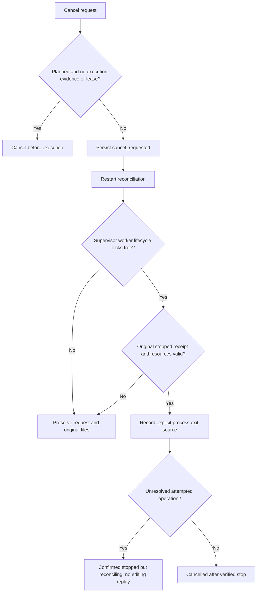
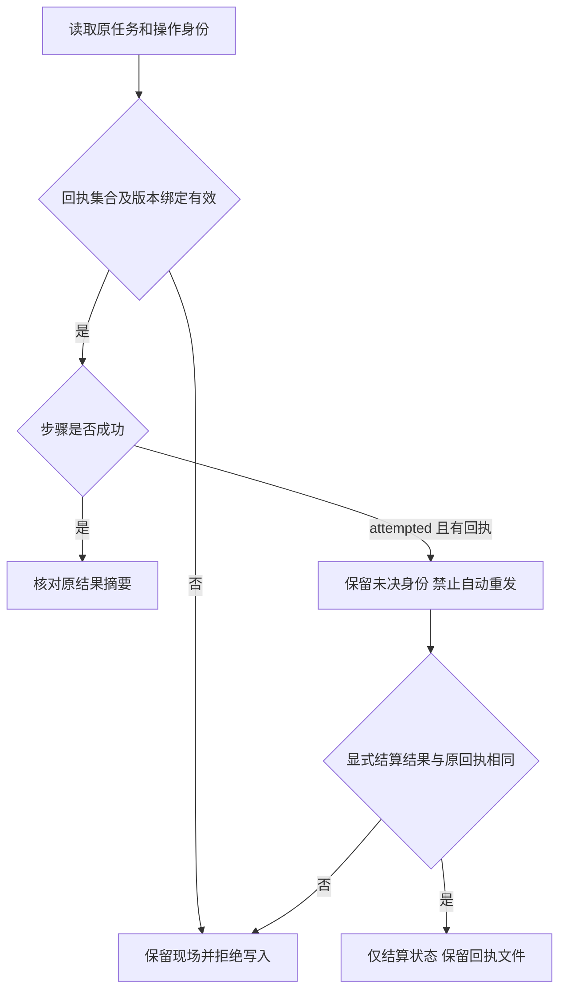
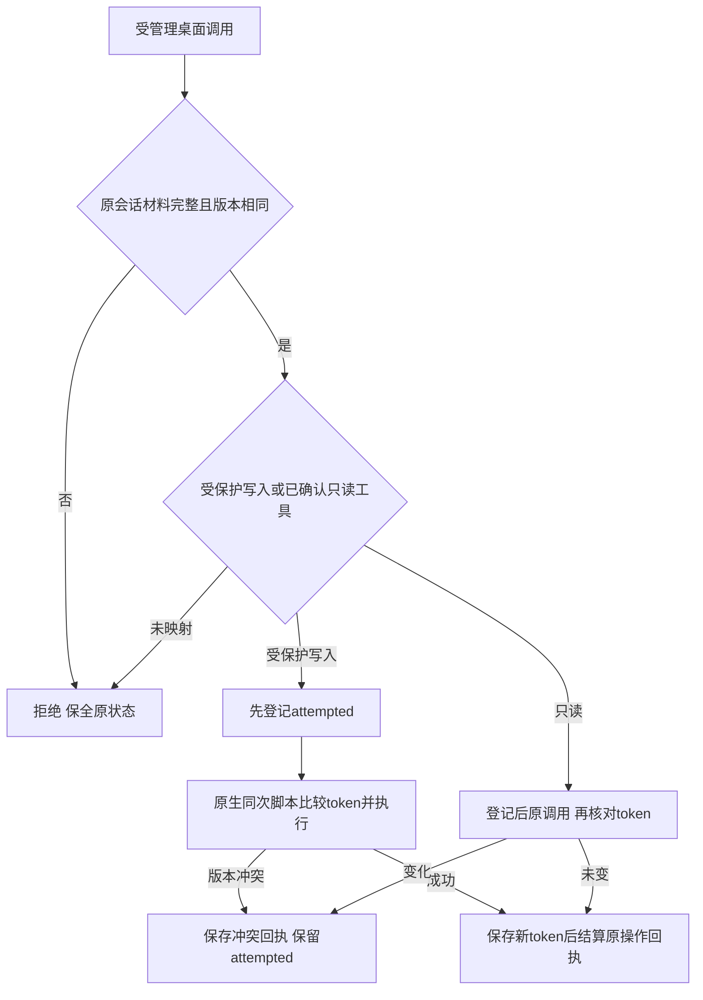
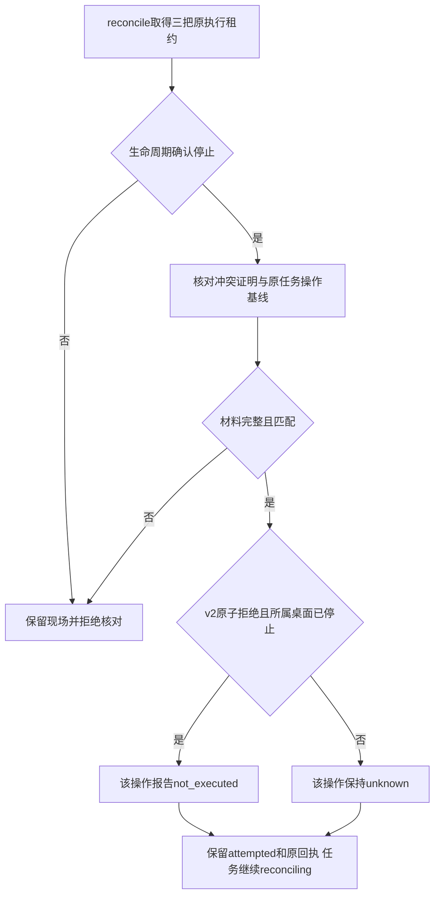
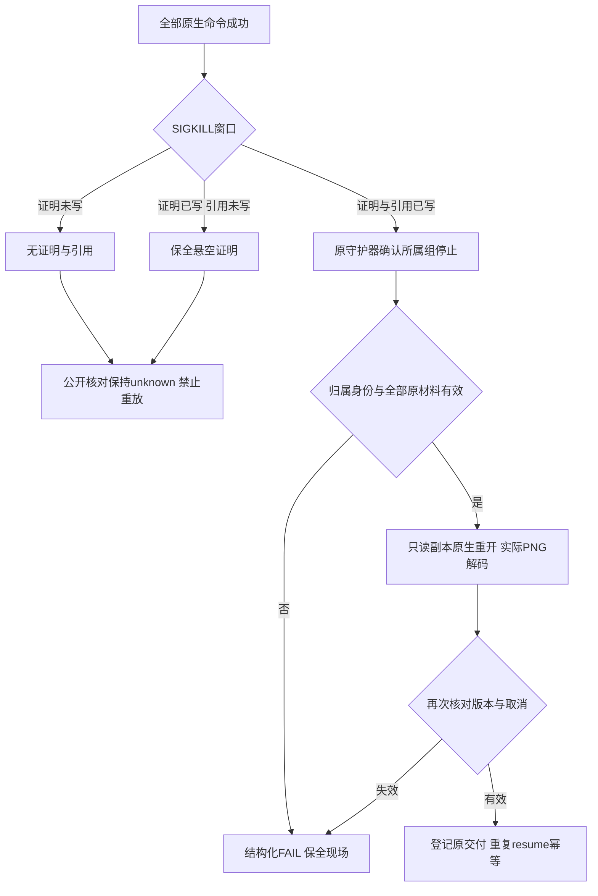
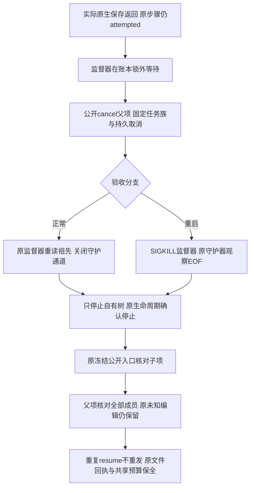
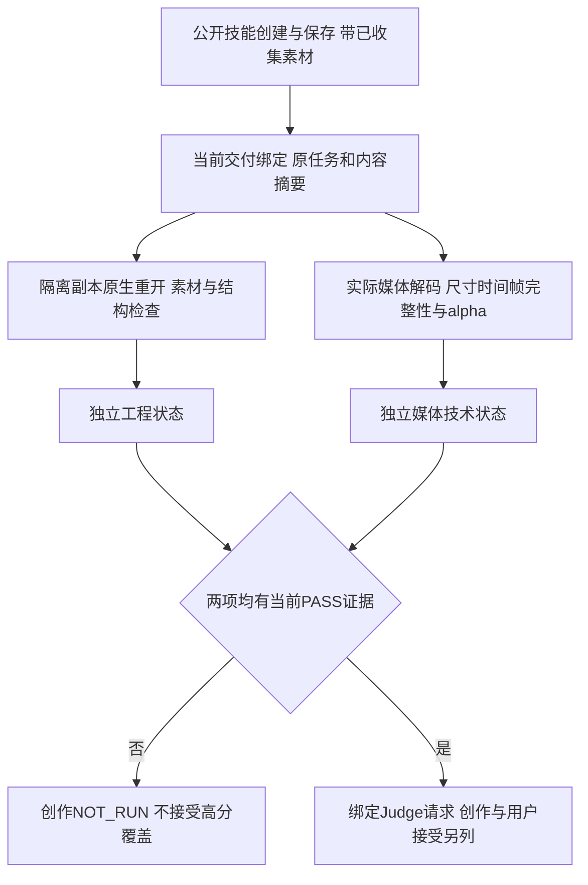
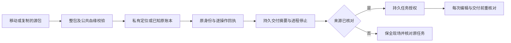
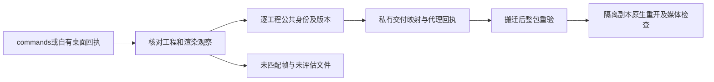

# EffectCraft V1 Design

## Context

动机和边界见 [proposal.md](proposal.md)。独立技能源已有未发布的受管理创作候选及局部真实验收；固定插件快照和完整跨平台、跨宿主 V1 验收尚未完成，具体状态以任务和当前摘要证据为准。EffectCraft 的代表任务是：制作品牌片头，交付可重开的 .ecproj 与可导入剪辑工程的渲染结果；修改文字后保持其他图层和动画曲线不变。

## Goals / Non-Goals

**Goals:** 独立技能分发、可信运行时、声明式计划编译、可恢复任务、原生工程与导出双重交付，以及可追溯质量结论。

**Non-Goals:** 不重写上游应用，不实现 SaaS，不把原生交付降为只有图片/视频，未通过原生交付与宿主验收前不宣称插件已完成。

## Decisions

1. 独立 `effectcraft-skills` 是知识事实源，插件同步不可变发布副本；替代方案“插件内手工维护一套技能”会形成漂移，予以拒绝。
2. 官方 CLI/MCP 是执行端，适配器编译声明式计划并核对能力；替代方案“LLM 直接拼接任意 shell”无法保证接口和副作用边界。
3. 沿用独立技能源现有 Python 执行器；用户目录内隔离 Python，任务记录采用带版本的 JSON、原子替换和独立进程锁。执行脚本随单技能分发，插件不增加平行运行内核。
4. 副作用先写意图和幂等键；不明确结果保留工程占用并 reconcile。替代方案超时自动重试会产生重复编辑或重复计费。
5. 公共协议由 ArtCraft 规范持有，领域仓只拥有自己的 payload 与映射。替代方案每个插件独立定义公共 JSON 将导致不兼容。
6. 技术验证与创作评估分离，已有有效用户授权持续生效；只在超范围动作或修改授权约束时要求新的授权。

## Component design

完整中英文运行时设计位于 [中文架构](../../../docs/EffectCraft-Runtime-Architecture.zh_CN.md) 和 [English architecture](../../../docs/EffectCraft-Runtime-Architecture.md)。领域计划对象包括 CompositionPlan, Composition, Layer, PropertyPath, Keyframe，以下能力逐项编译：

| 能力 | 行为边界 | 状态 |
| :--- | :--- | :--- |
| 合成建立与范围 | 显式设置合成尺寸、帧率、时长与工作区；输入的时间单位必须转换为适配器确认的上游单位。 | 计划中 |
| 图层与素材依赖 | 维护图层 ID、顺序、父子关系、素材引用和可见性；检查循环父子关系与丢失素材。 | 计划中 |
| 文字图形与关键帧 | 以属性路径记录文字、变换与关键帧，保留插值方式；修改文字不得重建无关动画。 | 计划中 |
| 效果与蒙版能力匹配 | 在应用效果或蒙版前发现命令与参数 schema；不支持的参数在执行前返回明确错误，禁止静默跳过。 | 计划中 |
| 透明与色彩交接 | 交接时记录颜色空间、位深、alpha 类型与编码；透明背景必须通过实际像素或通道检查验证。 | 计划中 |
| 工程与渲染交付 | 重开 .ecproj 验证图层与关键帧；渲染结果与源合成版本绑定；向下游提供素材化损失说明。 | 计划中 |

## State and recovery

核心状态为 planned、blocked、ready、running、reconciling、verifying、review_ready、completed、failed、cancel_requested、cancelled。同一原生工程单写；状态写入采用 epoch 防止过期执行者提交。原生应用不是账本事务的一部分，需要用检查点、文件核验和 reconciliation 收敛。父编排器不能将 accepted 当 completed，也不重复承担子插件的副作用重试。

## Risks / Trade-offs

| 风险 | 发现方式 | 处理与责任人 |
| :--- | :--- | :--- |
| R1 | 上游命令或格式变化 | Runtime owner：固定版本，比较 schema，重跑 fixture；未通过保持旧版 |
| R2 | 文字、透明或颜色交接损失 | Domain owner：保存源工程，生成 loss report，使用像素与对象检查 |
| R3 | 断线导致重复提交 | Harness owner：持久化意图与幂等键，先 reconcile，再决定重试 |
| R4 | 文档被误读为已实现 | Release owner：功能状态为 planned；无技能和运行时入口不得进市场 |
| R5 | ArtCraft 商标和受限许可代码边界 | Maintainer：独立实现；不复制上游 ArtCraft/Services 代码；品牌授权在发行前核对 |

## Migration Plan

新仓库无历史插件状态迁移。按 M1 运行时与技能 → M2 专业闭环 → M3 跨插件 → M4 宿主发布推进；ArtCraft 公共协议先定义，真实跨插件验收在领域端就绪后执行。升级采用版本目录与排空，保留旧组合；涉及状态 schema 时先备份，禁止不兼容回退。文档基线不进入可安装市场。

## Validation strategy

每条规范通过正向和失败场景验收；任务表关联需求 ID、测试与产物。验收覆盖清洁安装、原生重开、输出解码/像素检查、局部修改、中断恢复、重复调用与宿主加载。元数据检查、MCP 握手与单次调用不能替代完整创作验收。

## Deferred measurements

具体渲染吞吐、峰值内存、macOS x64/Windows/Linux 和各宿主版本兼容性必须通过 M2/M4 测量后填写，不影响当前本地优先架构与任务分解。名称与品牌资源使用由维护者在发行门禁核对。

## 交换报告实施决策

报告生成器属于各独立技能源，插件仅消费不可变快照。报告绑定原生、重开记录与导出摘要；lost/observed/unknown 不互相提升。ArtCraft 严格核验报告结构和实际文件，不允许 nativeSubstitute；历史无报告的交付不补造证据。实现与真实回归已验证，跨编辑器完整保真任务仍待验收。

## CLI 场景技能增量设计

参考 Dreamina 的 use / CLI / setup / 业务场景分层，但按真实命令划分任务。四原生 CLI 保持各自 argv 和工程保存语义；每个技能打包自己的最小运行资源，禁止跨技能文件路径。共有资源在仓库发布脚本中按摘要同步，避免手工维护多份逻辑。上游 ArtCraft 的 scene 保存、生成请求与异步轮询仅作为设计参考，不复制受限代码；EffectCraft 的执行事实源为独立 effectcraft-skills 仓库的 Python 工作流。原有 use 公开入口保持兼容。插件从新不可变技能源标签同步全部清单，宿主验收锁按新版本单独更新。

## 已批准优化实施（2026-10-08）

本轮继续使用本变更，不创建第二规格事实源。默认首次使用准备隔离 Python 和 EffectCraft；Codex 优先验收；已有授权内最多自动修订两轮、任务默认截止时间 1800 秒。代码与单技能资源在 effectcraft-skills，插件只消费不可变发布，未发布候选不得伪造 skills.lock.json 来源。

目标原生矩阵：macOS arm64/x86_64、Windows x86/x64/arm64、Linux x86_64/aarch64。Web 与 FreeBSD 使用独立通道并分别验收。平台锁、管道、安装与进程生命周期适配，不以字符串平台模拟冒充目标机测试。

任务入口 doctor/plan/run/inspect/reconcile/resume/cancel/review/revise；输出、源工程和会话均绑定身份。副作用前落盘 attempted；恢复先核对原结果，不能用新输出目录规避未知状态。旧会话缺少身份只允许诊断，不能自动重置。

新增任务的 identity.runtimeBinding 使用 effectcraft-execution-binding/v2（历史 v1 仅按其已有材料读取／核验，不补造 v2 启动证明），绑定原 Python、运行时根、原生版本和任务私有 execution/skill 执行资源清单摘要。绑定参与 identityHash，不能参与排除重复未知工作的 workKey。固定 Python 核验整个发行载荷；外部 Python 兼容入口只绑定可执行文件。资源通过私有暂存、前后摘要核对及同文件系统重命名发布；损坏或缺失现场不重建。公开恢复/评价/修订转交到原快照；POSIX 使用原位 exec，Windows 使用既有门控 Job 守护器和监督通道，退出后核对控制器生命周期。单一状态根的只读引用清单不构成跨状态根清理授权；安装器继续保留所有版本目录。升级/清理全门禁保持 9.1.4 范围。

技术验收与创作评价分离；Judge 回执绑定工程、产物、标准和时间范围。缺少解码或视觉证据保持 NOT_RUN。局部修订复核源版本、限定对象属性并验证非目标保全。双语文档记录候选与已发布版本边界。

实施顺序以任务 9.1–9.6 为准：先完成隔离安装和能力诊断，再把所有默认写入路径接到持久任务与核对恢复，随后完善技术/创作评估及受限修订，最后验证 15 个单技能、Codex 模型派发和固定分发。跨平台真实任务、Web/FreeBSD 与其他宿主分别留证；代码完成与目标机无法使用应记录为不同的开放项。旧 `craft-task/v1` 与 `craft-artifact/v1` 交付保持可读，状态 v2 为内部执行记录，不另建公共协议。

## 优化执行契约与阶段门禁补充

### 统一管理接口

| 操作 | 可观察行为 | 恢复/副作用约束 |
| :--- | :--- | :--- |
| doctor | 平台、依赖、锁定/实际版本、能力及恢复动作 | 只读，不安装 |
| plan | 校验计划、能力、输入及授权范围 | 不编辑工程 |
| run | 登记任务身份并执行 | 每个副作用调用前落盘 attempted |
| inspect | 查询状态、预算、产物和未完成步骤 | 旧记录可诊断 |
| reconcile | 核对原进程、工程、回执及摘要 | 不重新发送原编辑 |
| resume | 继续已核对且可恢复的任务 | 不更换原任务身份规避 unknown |
| cancel | 请求停止，追踪自有进程终止 | 确认退出才标记 cancelled |
| review | 技术与创作评价回执 | 绑定当前工程和产物 |
| revise | 原授权和预算内局部修改 | 复核版本、验证非目标内容保全 |

这些是行为合同，不代表所有公开入口已经完整实现。状态/回执显式版本化，公共 craft-task/v1 与 craft-artifact/v1 保持原所有权和兼容性。

### 安装与升级决策

每个技能自带 Shell/PowerShell 入口。Windows 采用官方 Python 嵌入式发行；macOS/Linux 采用固定 python-build-standalone install_only。构建时核定共同受维护的 3.13 补丁版本及制品来源、摘要、许可、最低系统/libc；运行时只读锁。安装在用户目录暂存、校验、安全解包、互斥、原子发布；离线导入执行相同验证。升级可以为新任务准备新版本，但保留活动任务仍引用的解释器和 EffectCraft，不切换旧任务版本。

参考来源（制品清单需在实施时按具体版本核对）：[Python Windows 发行](https://www.python.org/downloads/windows/)、[Python Build Standalone](https://github.com/astral-sh/python-build-standalone/blob/main/README.md)。Web 通过真实浏览器适配器，FreeBSD 通过固定源码构建；均独立验收。

### 分阶段验收

| 阶段 | 前置与输出 | 阶段通过条件 | 未满足时 |
| :--- | :--- | :--- | :--- |
| 一：安装与发现 | 双启动入口、平台锁、安全安装、doctor、命令差异 | 每个目标平台空环境启动、版本校验及原生代表任务 | 目标格保持 NOT_RUN/FAIL，不借其他平台结论 |
| 二：执行与恢复 | 阶段一运行时身份；统一账本、工程/会话单写、恢复与取消 | 崩溃、响应丢失、并发、取消均无未经核对的重复编辑 | 保留 unknown 和现场，禁止重做 |
| 三：验证与修订 | 阶段二任务/产物身份；技术检测、真实 Judge、预算 | 至少一个真实视觉问题经局部修订、再验证并保全非目标 | 不以技术通过替代创作或用户接受 |
| 四：独立技能与分发 | 已验证技能源候选、15技能资源及宿主元数据 | 实际安装技能的 Codex 自然语言闭环、透明交接及固定快照校验 | 其他宿主、未验平台与未发布候选分别保持开放 |

测试按需求提取可观察行为，先确认目标红灯，再实现与回归；组合测试使用真实适配器返回类型，从公开入口贯通安装器、执行器、回执和恢复。既有 27 项针对性测试及受影响回归须保留；测试清单增长不能删去旧验收要求。任务勾选需关联需求、实现、测试、当前源码/输入/产物摘要及目标环境证据。

### 分段残留与再次调用的恢复边界

残留分段仅在原任务已登记其目录身份、进程树已停止且工程/运行时/检查点匹配时进入恢复。归档在移动前记录源、私有目标、目录身份、文件集合/摘要及阶段；优先使用同文件系统的原子目录移动，不能安全移动时保留现场，不降级为覆盖或删除。恢复位置位于成功交付之外，仍纳入本任务媒体占用。reconcile 只核对已经尝试的移动；显式 resume 才开始新的归档和后续渲染。未登记目录或用户新增内容不自动处理。

共享账本区分计划预占和实际原生尝试：首次调用由原计划预占覆盖，未完成段的再次调用在启动前追加持久化尝试身份及额外帧数/解码量；复用完整段不再扣算，同一尝试重复核对不重复扣算，失败消耗不归还。预算不足时停止调用，不能用新任务身份、目录或相同计划摘要绕开限制。

验收分别覆盖段间异常、原生写出但尚未发布时中断、原生写入过程中强杀、归档移动前后崩溃、归属冲突及重试预算耗尽。前两者通过不能替代原生写入中强杀或其他平台验收，任务 9.13、9.14 仅追踪对应组件，9.3 综合门禁保持独立。

## 命令交付观察与复检整合

9.3.6/9.4.1沿用同一受管理任务身份。commands.execute向受管理调用方提供可选观察回调，原CLI默认不启用；desktop_session传递同一回调。保存与渲染前只读查询原生合成/图层，合法返回后绑定实际输出。内部effectcraft-command-delivery/v1记录保存于任务目录，绑定任务身份、成功回执及完整交付文件清单；不会占用公开输出文件名，也不建立平行公共交接协议。历史缺记录的命令任务只诊断，不补建可信基线。

复检同时核对观察记录与原始输出，使用固定原生运行时隔离打开每个当前保存工程，验证全部合成和图层；每份媒体使用其自身渲染时快照，不能使用后来修改的工程元数据。工程、技术、创作和用户接受保持独立状态；未支持的导出类型与创作评价整合明确保持开放。

命令/桌面Judge复用effectcraft-judge-request/v2、receipt/v2和现有任务族账本。evaluation-scope/v1通过contexts兼容扩展表达多个合成/原生版本，每个媒体绑定独立context与帧索引；覆盖按context分别判定，并要求实际观察请求内媒体，不把不同作品帧索引合并。workflow旧单上下文合同保持兼容。命令质量适配仅读取任务内部观察，不伪造manifest/native.json，不重写交付。局部修订继续作为既有9.4完整闭环的剩余范围。

命令/桌面修订不扩展craft-command-plan/v1。管理plan/run可通过单独revision-scope参数绑定根任务授权（保存工程路径、comp/layer创建别名、允许属性）。内部effectcraft-command-revision/v1请求绑定当前command-delivery摘要、选定工程及显式comp/layer静态属性编辑；当前Judge FAIL和全部工程/技术门禁通过后才扣共享轮数。子任务沿用commands或desktop模式和原运行时，原工程副本置于任务私有目录，素材通过原字节摘要复制到新输出，重新保存/渲染所有当前工程/绑定PNG。比较全部原生JSON字段，除声明素材位置搬迁与授权属性value外不得变化；非目标媒体像素保全。原件与源任务不改写，失败保留预算/activeRevision及现场，不自动重试。视频/序列和动画属性时间范围属于仍开放的完整范围，不用静态修订声明这些验收完成。

命令修订生成器具有显式内部版本：旧版计划只用于核对；新版在每次静态编辑前先选中同一授权合成的目标图层，满足上游原生注册表前置条件。核对旧版不以新生成器重写计划。注册表阻断的编辑只有在调用账本与失败日志完整对应、所有已发送调用均为查询/open_project/comp.open/layer.select、原进程确认停止、源交付与私有种子不变且未生成新工程/媒体时，才结算为明确未执行；预算不退回、不自动重发。其余结果保持未知。

### 安装回执与双版本升级核对

版本目录彼此隔离。安装互斥内，复用不仅核验二进制／载荷摘要，还核验无重复字段的UTF-8安装回执及固定版本、平台、官方来源、归档／二进制摘要和实际版本输出。坏回执保全，不以重新下载掩盖身份漂移。双版本原生验收使用官方0.3.1及0.4.0隔离缓存，旧任务保留原执行快照，安装新版后分别恢复旧任务与创建新任务；此验收不能替代跨状态根的清理授权与其他目标平台。

### 隔离Python升级与旧任务启动边界

本机双隔离Python完整发行升级证据见9.28；其正常升级成功不等于新前端安装失败时仍可恢复旧任务。9.29须在不执行当前Python的条件下，从原任务私有资源验证启动材料及原解释器身份，才派发原控制器；不得直接执行未核验的任务路径、重建旧快照，或把当前版本作为旧任务的隐式前置条件。原生运行时参数亦须保持绑定身份，跨状态根清理继续单独验收。

9.29实现约束：新增显式v2执行绑定，身份摘要包含启动描述的SHA-256。冻结时在同一原子发布目录写入原身份JSON与固定字段TSV启动描述；两公开入口在准备当前Python前选择已有任务，核对顶层身份与identityHash、描述摘要、原平台／系统下限及原解释器完整载荷，然后仅执行当前安装包内的只读派发校验器。校验器重读原任务／完整快照并核对描述与绑定一致，才交接原控制器及runtimeHome；Windows沿用stdin所有权与门控Job监督。无描述的历史记录不自动补建或迁移；新建任务继续走当前安装入口。此为本地用户目录内的完整性检查，不引入签名或抵抗同一用户同时重写所有身份和摘要的安全声明。

### 启动窗口与取消重启组件

planned并非进程未启动的证明；取消在账本锁内非阻塞核对监督器、生命周期及worker租约，已存在执行材料或租约占用则持久请求停止。reconcile按监督器→生命周期→worker→账本的顺序取得锁，只核对原stopped回执及资源；无未决操作才cancelled，未知操作保持reconciling、原身份与回执。`effectcraft-managed-process-exit/v1`记录退出来源、业务结果核对状态和观察时间，强制组停止的业务退出码为null；老无扩展记录保持原读取合同。完整任务族终态屏障和各目标平台仍由9.3.4等开放门禁负责。

父子取消终态屏障（开发版source52／plugin54）：根取消意图与后代身份先落盘，后代仍活跃／缺少停止证明时保持cancel_requested；各子任务经原控制器核对后，未知编辑传播为父任务reconciling。未启动证明只在原取消时取得全部执行租约后生成，重启不补造。27项取消测试及真实macOS原生父子中断恢复通过；完整崩溃／GUI矩阵、其他原生平台、固定宿主与V1仍开放。证据：`docs/evidence/cancel-family-candidate-20261009.json`。

## 当前实现定位与能力证据（9.6.3）

执行事实源为独立技能源的 `skills/effectcraft-use/scripts/`：管理入口 `managed.py`、账本 `task_store.py`、父子取消 `cancellation.py`、绑定与快照 `runtime_binding.py`、绑定解释器启动 `task_entry.py`／`task_entry.sh`／`task_entry.ps1`。上述路径在技能源维护，再由插件 `skills.lock.json` 固定消费；不在插件根创建第二执行内核。

维护者生成器为技能源 `scripts/build_capability_matrix.py`，当前产物为两仓 `docs/current-capabilities.json`。`effectcraft-capability-matrix/v2` 为内部文档格式，保留平台字段并增加显式证据绑定；不是公共 craft 协议。完整技能载荷须与当前原始只读安装报告的文件／模式清单摘要对应，Python、原生制品和报告摘要亦须匹配。证据失效时输出 NOT_RUN 和原因；插件 `scripts/capability_reference.py` 只校验分发文档，不承担执行。README 保留当前入口和精确门禁，原文移入同仓 `README-HISTORY-20261009*.md`，由版本历史链接。

公共协议仍以 `docs/contracts-reference.json` 固定的 ArtCraft 标签、提交与四份文件为权威。当前源代码及 Git 对象校验通过不关闭其他平台／宿主或 V1。

### v2 操作回执读取与中断结算

技能源 `task_store.py` 在读取 v2 记录时先验证操作 ID，再检查完整 receipts 目录；回执版本、任务、操作与 argumentsHash 必须与原 attempted 绑定，成功步骤还绑定 resultHash。无归属文件、非普通文件及链接保留现场并拒绝写入。已写回执但状态尚未结算属于合法中断：读取保持 attempted，不能推断编辑未执行。finish_step 只能用同一原结果完成结算，保留既有回执文件；不同结果拒绝覆盖。旧 v1 保留只读诊断合同。

9.3.5 验收对应管理接口职责与错误语义；本机公开 workflow 正向及三个模式预检/未知重放拒绝与历史材料拒绝分别留证。9.3.6 的后续本机三模式适配器组合验收见当前证据；各目标平台原生验收和固定宿主自动派发仍独立开放，不从本机管理合同验收推导完成。

9.3.6的当前本机组合证据为`docs/evidence/managed-three-mode-composition-20261009.json`：同一发布载荷经公开Shell到固定安装器、headless／真实owned desktop适配器、账本、回执与核对入口；本例使用原未知计划改变task／output核验自动重放拒绝；不同计划不用于证明这条拒绝合同，不改变既有未知编辑不得重放的要求。真实对象错误的保守unknown与完整响应丢失／GUI冲突矩阵分开；9.3.3／9.3.4继续开放。安装证据复用隔离Python缓存，独立空原生缓存和签名桌面安装另行记录，不声明Python冷安装、全平台或宿主模型派发。

默认写入指引通过三模式显式选择进入现有受管理执行层，旧CLI保留兼容入口。9.3.1的15技能／45预检／18历史状态组合及未变执行资源原生绑定见 `docs/evidence/managed-default-routing-20261009.json`；指引更新不提升宿主自然语言派发证据。source55／plugin57分发采用先发布技能源再锁定快照，原候选证据保留采集时点。

源工程运行期冲突保护（9.3.2候选）：同一只读核对函数用于start、begin_step及delivered；每个MCP tools/call写入意图登记前检查绑定源工程摘要，丢失、不可读和链接替换与内容变化均返回revision_conflict。完成原调用后仍登记其真实回执，不因随后发生的用户修改丢弃已知结果。最终交付前再检查，不把启动时一次检查当作运行期间版本稳定证明。该候选不构成内存GUI版本、跨状态根工程锁或完整桌面会话竞争的验收，9.3.2保持开放。技能源修改不覆盖插件已发布固定技能。

跨账本源工程认领（9.3.2候选）：`project_claims.py`使用固定用户目录`.local/share/craft-tasks/effectcraft-project-claims`，不随公开state-root改变。路径键及device/inode文件对象键覆盖原路径换文件与硬链接；全局互斥内先核对全部旧认领，再写显式effectcraft-project-claim/v1和新任务。原账本、taskId、identityHash、nonce与任务内projectClaims互相核对。写认领后、写任务前崩溃留下未确认占用，不自动清理；活跃／unknown／缺失原状态／坏认领均阻止新任务。开始、逐调用和交付前只读核对原认领，只有完整可核对且无attempted操作的终态可让出。没有共享材料的旧冻结运行时不补造协调证明；真实GUI内存变化、旧版本并行及完整桌面会话竞争仍属于未完成9.3.2。

文件对象代际修复（9.3.2候选）：dev.57 Linux CI暴露临时源工程删除后device/inode复用与旧账本缺失共同造成误占用。新认领在对象键中加入创建时间的整数秒／纳秒身份：macOS、Windows、FreeBSD读取原生birth time，Linux读取statx的STATX_BTIME且复核设备与inode。缺少支持时失败关闭，不回退到会随编辑变化的ctime/mtime。旧任务继续使用原双键；新认领遇到旧inode键仍保守核对，未知材料不自动清理。新增任务显式保存代际算法版本，避免静默改变旧记录的恢复依据。旧冻结执行器的双向并行协调仍未验收。

受管理桌面版本保护（9.3.2候选）：`desktop_revision.py`在owned desktop工厂绑定任务身份、会话nonce、工程修订／路径／活动项／选择／dirty与完整editor.state，显式effectcraft-desktop-revision/v1落盘。初始化只接受空会话且无原步骤；已有或损坏／缺失材料不重新定基线。每次调用前核对源任务及内存上下文；execute_command、batch、open_project、save_project与run_script在同一次原生脚本中稳定比较预期token再执行，保留原工具成功返回类型及脚本output。run_script使用同一解释器的eval；原生禁止脚本递归执行script.run，已通过固定0.4.0验证。明确只读工具可原调用后复核，期间版本变化保全未决回执。其他未映射工具在发送前拒绝，提示使用引擎命令或受保护脚本，不以事后检测替代写入前保护。

原生原子检查冲突证明单独保存在原操作desktop-conflict回执中，尚不自动改写reconcile结算规则；响应丢失或无法确认的编辑不重发。当前证据区分headless映射、真实签名桌面独立控制连接修改、公开Shell已安装单技能组合与宿主自然语言派发。控制连接修改不写成物理人手GUI点击证据；旧冻结版本双向竞争、全部高层写工具、其他目标原生系统及完整9.3.2仍开放。

桌面原子冲突核对使用内部 effectcraft-desktop-conflict/v2，绑定任务 identityHash、operationId、operation、argumentsHash、sessionNonce 及原 desktop-revision.json 摘要。reconcile 在取得三把执行租约及核对停止材料后只读验证原基线与证明，返回逐操作 not_executed／unknown；不改原 attempted 或 succeeded 回执，也不将失败桌面会话视为可续跑会话。v1 缺少完整绑定仅作 unknown 诊断。该组件不替代完整9.3.3/9.3.4验收。

完成登记窗口恢复由内部 effectcraft-command-completion/v1 承载。worker仅在commands／desktop成功返回、全部原生步骤回执成功时，持久化原任务／原运行时绑定、原请求、成功日志、输出目录身份与产物清单、全部步骤及回执摘要，再登记完成证明引用。缺少引用的悬空证明不自动接管。reconcile取得原三把执行租约，短暂持账本锁读取身份，释放账本锁后进行只读原生重开和媒体检查，重新持锁复核取消、版本与所有原材料后提交review_ready。正常执行与恢复共用同一完成证明验证器；任何阶段均不重发创作。该路径与未完成普通编辑及分段渲染恢复分别核验。

完成证明窗口的真实故障验收（9.35）：只在测试worker驱动中注入SIGKILL，执行当前冻结的生产代码与固定0.4.0原生CLI／签名桌面，不在生产载荷引入故障开关。分别覆盖完成证明写入前、immutable证明写入后但任务引用保存前、任务引用保存后。前两窗保留running原账本、原回执及悬空文件，公开核对后保持unknown；后一窗仅在原守护器负退出／所属组停止、全部原材料及只读重开／PNG解码通过时补齐交付。验收不手工修改任务状态或伪造生命周期，校验重复resume保全文件字节／inode／mtime、原操作与预算，并核对不属于该组的进程仍存活。

进程归属字段严格区分“缺失”与“损坏”：既有非POSIX生命周期无ownership字段时沿用原合同；显式字段必须是effectcraft-posix-group-lease/v1对象和32位小写十六进制nonce。无效形状在原生检查前形成ValueError，由公开入口输出FAIL JSON，原账本／作品不变；不通过AttributeError traceback丢失结构化诊断，也不补造归属。

### 父子原生取消验收方法（9.36）

沿用EC-TX-005的父子取消终态屏障与原控制器合同，不引入新的生产故障开关。验收从只读单技能复制并冻结原执行资源，登记未调度的编排父项及实际原生子项；子项通过真实commands／owned desktop创建、预览和保存。仅在测试进程内延迟保存返回后的回执登记，保留原attempted。正常分支让原监督器观察祖先取消并关闭通道；重启分支在监督器释放账本锁后暂停它，公开cancel父项落盘，再SIGKILL该监督器，依靠原独立守护器观察EOF清理所属树。不得人工修改任务终态、生命周期或业务退出结果。

本方法证明已登记但未调度父项与实际原生子项的取消，不冒充已成功创作的父工程、完整局部修订任务族、自然语言模型派发、冷安装或其他原生平台。原任务资源、截止与修订预算沿原身份核对；命令帧解码预占读取commandFrames，不能误用workflow专属顶层字段。工程核对只创建隔离副本，不为原未知保存补造成功回执。

### 技术门禁覆盖与原生交付验收（9.4.1）

采用现有quality_review、engineering_review及command_delivery真实执行器，不新增生产开关。独立只读技能通过公开Shell启动固定隔离Python，实际导入并收集素材，分别输出MP4、普通透明序列及分段透明序列。原生重开在隔离副本核对依赖及结构，媒体检查重新解码，而非读取元数据即通过。保存后的工程、媒体与成功步骤回执在重复恢复时保持原样。

真实负例复制当前作品后修改视频、删除收集素材或损坏原生工程，重新计算副本包摘要，使坏视频到达实际ffprobe而非停在摘要不匹配；高分v2测试回执用于挑战技术门禁，不充当视觉评价证据。媒体可解码但工程损坏时，技术PASS和工程FAIL分别记录，创作及用户接受仍NOT_RUN。原作品和原任务不改写。格式未知或命令输出缺少观察材料时仍NOT_RUN；完整逐命令域、其他目标原生平台及自然语言宿主派发遵守各自未完成门禁。

## 工作流产物血缘增量（EC-AR-001）

沿用 ArtCraft 固定所有权的 craft-artifact/v1；交付 manifest 保持 effectcraft-delivery/v1，增加公共 artifact 对象及显式版本的内部 artifactBinding。原生工程为主产物，帧、视频、序列描述及实际帧文件为派生引用，素材以包内依赖摘要关联。包版本由生产身份、源引用与全部文件摘要生成，不能仅用文件名或原生工程摘要代表完整交付版本。所有引用只含包内路径；task、plan、runtime 与父产物分别绑定。独立 CLI 明示 standalone，旧包不补造来源。

先验证工作流公开入口。命令／桌面多工程交付、字体和 LUT 依赖发现及全公共协议资格保持原任务5.2／5.3开放；不会以本组件替代这些门禁。插件快照继续消费已发布source61，本地候选执行代码仅维护在技能源。

源包授权额外使用显式effectcraft-source-package/v1私有绑定，包含清单摘要与源产物引用；Store在每次原生副作用登记和最终交付前重验整包，源清单或依赖变化即source_package_changed，保留原步骤与回执而不继续写入。旧任务没有此绑定时不自动补建；旧冻结执行器继续使用原资源。测试同时验证两个源变化负例没有增加操作、没有交付，并保持原账本。

### 工作流来源生产任务核对候选

私有 `effectcraft-artifact-producer/v1` 定位记录以任务ID和identityHash共同寻址，在导出包发布前建立；路径只存在用户目录，不进入公共craft-artifact/v1。原任务保存显式版本的定位摘要，损坏／冲突／丢失不得补写覆盖。历史无该扩展的任务仅在已有原账本内只读核对，不猜测外国任务完成。新任务授权中的 `effectcraft-source-producer/v1` 绑定原账本、任务、身份及交付摘要；该记录不替代原回执或物理停止材料。

证据 `docs/evidence/source-producer-guard-candidate-20261009.json` 区分未发布候选、当前本机原生强杀／拒绝／成功修订与历史夹具失败。完整9.3.3、命令／桌面来源映射、旧未知包、跨平台与模型派发不由此关闭。

### 命令与自有桌面产物映射

`command_artifact.py`消费同一ArtCraft持有的公共协议。`effectcraft-command-artifact-map/v1`在私有交付记录中保存原观察、文件表和显式版本；代理收到引用及公共对象。每个原生工程独立逻辑身份，多合成完整上下文保留，只有原观察与原生版本、依赖都匹配的PNG才归入工程。父版本来自已核对的源任务；旧记录不自动补建。输出与映射整包移动后重验安全相对路径和内容，读取不重发编辑；原用户工程和媒体不改写。无实际损失报告时lossReportRef为null，exchangeLoss为NOT_RUN。

5.1／5.2／5.3仍开放：当前原生映射组件不替代字体／LUT发现、原生子修订、其他平台、固定宿主派发或完整协议资格。source63发布后插件65只消费不可变标签快照。

### 原生字体与LUT观察

技能源共享 `native_resources.py` 只读取保存的 schema1 工程；生成版本化的 `effectcraft-native-resources/v1` 观察，随工作流清单或命令产物映射绑定，并在 review 中分别输出 dependencyClosure 与 fidelity。字体声明不具备真实字体文件摘要，保留明确未验证原因；LUT仅以实际内联或包内文件字节构造公共依赖。包外、链接和缺失资源不读取。文件LUT运行时相对路径及字体fallback的实际解析不由静态闭合证明。旧扩展缺失时保持原版本算法和只读身份，不自动迁移。
