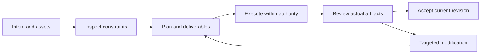

# EffectCraft V1 — 功能与界面规划

> **文档说明**：V1 实施阅读视图；规范事实源为 OpenSpec。
>
> **版本**：1.0.0
> **最后更新**：2026-10-05
> **状态**：目标设计；尚未实现。事实依据与验收结果单独标注。

关联文档：[品牌边界](../1%E3%80%81EffectCraft-%E5%91%BD%E5%90%8D%E4%B8%8E%E5%93%81%E7%89%8C%E8%AF%B4%E6%98%8E.md) · [技术方案](../5%E3%80%81EffectCraft-%E6%8A%80%E6%9C%AF%E6%96%B9%E6%A1%88%E4%B8%8E%E8%B7%AF%E7%BA%BF.md) · [详细架构](../../../docs/EffectCraft-Runtime-Architecture.zh_CN.md) · [OpenSpec](../../../openspec/changes/establish-v1-plugin/proposal.md) · [证据](../../../docs/evidence/runtime-baseline.json)

## 1. V1 功能模块

| 能力 | 行为边界 | 状态 |
| :--- | :--- | :--- |
| 合成建立与范围 | 显式设置合成尺寸、帧率、时长与工作区；输入的时间单位必须转换为适配器确认的上游单位。 | 计划中 |
| 图层与素材依赖 | 维护图层 ID、顺序、父子关系、素材引用和可见性；检查循环父子关系与丢失素材。 | 计划中 |
| 文字图形与关键帧 | 以属性路径记录文字、变换与关键帧，保留插值方式；修改文字不得重建无关动画。 | 计划中 |
| 效果与蒙版能力匹配 | 在应用效果或蒙版前发现命令与参数 schema；不支持的参数在执行前返回明确错误，禁止静默跳过。 | 计划中 |
| 透明与色彩交接 | 交接时记录颜色空间、位深、alpha 类型与编码；透明背景必须通过实际像素或通道检查验证。 | 计划中 |
| 工程与渲染交付 | 重开 .ecproj 验证图层与关键帧；渲染结果与源合成版本绑定；向下游提供素材化损失说明。 | 计划中 |

## 2. 宿主流程

## 3. 界面载体与责任

宿主展示计划卡、任务状态、预览与交付链接；原生编辑器承担精细人工编辑。诊断 JSON 供维护者读取，用户默认看到问题含义、影响范围与可执行恢复动作。

## 4. 异常状态

无素材显示缺失清单；无能力显示不支持项；执行中显示真实进度或未知进度；取消待确认保留占用；验收失败展示失败门禁与证据；不显示伪造百分比。

---

**文档版本**：1.0.0
**创建日期**：2026-10-05
**最后更新**：2026-10-05
**文档状态**：待评审；实现以 OpenSpec 任务和证据为准。
