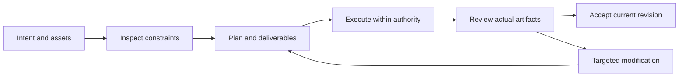

# EffectCraft V1 — Interaction-Plan

> **Purpose**: V1 implementation reading view; OpenSpec is normative.
>
> **Version**: 1.0.0
> **Updated**: 2026-10-05
> **Status**: Target design, not implemented. Observations and acceptance evidence are identified separately.

Related documents: [Brand boundary](../1%E3%80%81EffectCraft-Naming-and-Brand.md) · [Technical plan](../5%E3%80%81EffectCraft-Technical-Plan.md) · [Detailed architecture](../../../../docs/EffectCraft-Runtime-Architecture.md) · [OpenSpec](../../../../openspec/changes/establish-v1-plugin/proposal.md) · [Evidence](../../../../docs/evidence/runtime-baseline.json)

## 1. V1 functional modules

| Capability | Behavioral boundary | Status |
| :--- | :--- | :--- |
| Composition creation and range | Set composition dimensions, frame rate, duration and work area explicitly; convert time units according to the verified adapter contract. | Planned |
| Layers and footage dependencies | Maintain layer IDs, order, parenting, footage references and visibility; detect parent cycles and missing footage. | Planned |
| Text, graphics and keyframes | Record text, transforms and keyframes by property path with interpolation; text revision must not rebuild unrelated animation. | Planned |
| Effect and mask capability matching | Discover commands and parameter schemas before applying effects or masks; reject unsupported parameters before execution rather than skipping them. | Planned |
| Alpha and color handoff | Record color space, bit depth, alpha interpretation and codec during handoff; verify transparency from actual pixels or channel inspection. | Planned |
| Project and render delivery | Reopen .ecproj to inspect layers and keyframes; bind renders to composition revisions and report editability lost by baking. | Planned |

## 2. Host journey

## 3. Surfaces and responsibilities

The host presents plans, task states, previews and delivery links; native editors support detailed manual editing. Diagnostic JSON is for maintainers; users see the issue, affected scope and actionable recovery.

## 4. Exceptional states

Missing assets show a checklist; missing capabilities show unsupported operations; running tasks show real or explicitly unknown progress; pending cancellation retains occupancy; failed acceptance shows gates and evidence. Do not fabricate progress percentages.

---

**Document version**: 1.0.0
**Created**: 2026-10-05
**Updated**: 2026-10-05
**Document status**: Ready for review; implementation status is governed by OpenSpec tasks and evidence.
